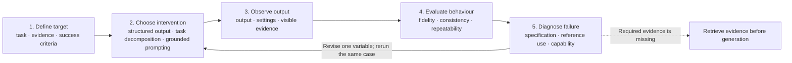

# Assignment 1: Prompt-Engineered Animation Reconstruction

**Language:** English | [中文版本](Specification-zh.md)

## Purpose

This assignment assesses your ability to use prompt engineering as a controlled, evidence-based process.
You will reconstruct a short reference animation by using prompts and supplied visual references, then demonstrate how each prompt intervention changed the generated result.
The quality of the final animation matters, but a polished result without an inspectable prompt-engineering process will not satisfy the task.

After completing the assignment, you should be able to:

1. translate a visual goal into observable success criteria;
2. design and test controlled prompt interventions;
3. record model outputs and compare them under fixed conditions;
4. diagnose specification and reference-use failures;
5. communicate a reproducible prompt strategy and a bounded conclusion about its effectiveness.

## The task

Create a high-resolution, metallic reconstruction of the supplied six-second animation.
Your animation should preserve the original composition and action sequence while replacing the low-resolution appearance with the material quality shown in the supplied references.

The target scene contains three faceless humanoid figures interacting with dark and light spheres in front of a large black-and-ivory Taijitu.
The Taijitu should remain visually stable while the figures perform a coordinated sequence of reaching, lifting, passing, receiving, crouching, and returning toward the opening arrangement.

You must solve the task primarily through prompting and generation controls.
You may use text prompts, negative prompts, reference-image or reference-video conditioning, prompt weighting, seeds, and standard model settings.
Post-processing is limited to trimming, looping, resizing, frame-rate conversion, and file compression.
Manual frame-by-frame repainting, authored 3D replacement, or motion editing cannot substitute for the prompt-engineering work being assessed.

## Choice of model or service

You may use any LLM, generative AI model, or online service capable of completing the task.
No particular provider, model, or paid feature is required or preferred.
Use free services and free quotas wherever possible, and explore alternative free services when one service cannot complete the task within its available quota.
We do not recommend paying for additional credits or a subscription solely for this assignment.

Assessment focuses on your prompt-engineering method, the evidence produced by your iterations, and the quality achieved within the controls available to you.
Using a paid model or service does not earn marks by itself.
You are not required to test a large number of providers; use as many free options as are useful and practical for your process.

## Supplied references

| Reference | Purpose |
| --- | --- |
| [Motion reference](assets/motion-reference.gif) | Defines the composition, three-character action sequence, sphere interactions, timing, and loop behaviour. |
| [Taijitu material reference](assets/taijitu-material-reference.png) | Defines the black-and-ivory geometry, polished material, rim, lighting, and shadow character of the background object. |
| [Humanoid material reference](assets/humanoid-material-reference.png) | Defines the faceless metallic humanoid style, body proportions, surface finish, and lighting response. |

Treat the motion reference as the source of truth for action and timing.
Treat the two still images as material and appearance references; they do not replace the required composition or motion.

## Required output

The final animation must:

- use a square 1:1 frame;
- run for 5-7 seconds and form a clean loop;
- be at least 720 x 720 pixels;
- use at least 12 frames per second;
- retain three distinguishable humanoid figures throughout the sequence;
- retain the large Taijitu's geometry, orientation, framing, and black-and-ivory material;
- preserve the main sphere transfers and the broad pose sequence of the motion reference;
- maintain coherent anatomy, foot contact, hand-to-sphere contact, lighting, and shadows across frames;
- avoid visible morphing, duplicated limbs, identity swaps, background drift, object flicker, and abrupt temporal jumps.

Submit an MP4 or WebM master.
A GIF is acceptable only when it preserves the required resolution, timing, and visible detail.

## Required prompt-engineering process

Follow the M02 Prompt Engineering control loop throughout your work.

Use this loop for every reported iteration: define what success means, select one controlled intervention, preserve the output, evaluate it against the same evidence, diagnose the failure, and then revise one variable.

### 1. Define the target

Before generating, decompose the task into checkable requirements for composition, motion, Taijitu geometry and shading, humanoid material, temporal consistency, loop behaviour, and technical format.
State how you will recognise success and failure for each requirement.

### 2. Choose an intervention

Create a baseline prompt, then complete at least three controlled revisions, producing a minimum of four prompt versions in total.
For each revision, change one prompt variable or one clearly bounded prompt block and state the effect you expect before generating.
Examples include motion sequencing, background-locking language, contact constraints, material description, camera constraints, or a negative-prompt block.

Keep the generation tool, model, duration, aspect ratio, and other settings fixed during a comparison whenever the platform allows it.
Keep the seed fixed when the platform exposes seed control.
If a setting cannot be fixed or reported, identify that limitation rather than claiming a controlled comparison.
You may move to another free service when quota or capability limits prevent further work.
When you change the model or service, record that change and do not attribute the resulting difference to the prompt alone.

### 3. Observe the output

Preserve the exact prompt, negative prompt, reference inputs, tool and model name, settings, seed when available, and raw output for every submitted version.
Describe what changed without yet claiming why it changed.

Use the same five checkpoints for every version: 0%, 25%, 50%, 75%, and 100% of the animation duration.
At each checkpoint, inspect character count and placement, pose and action, sphere contact, Taijitu stability, material and shadow continuity, and visible artefacts.

### 4. Evaluate behaviour

Compare every prompt version using the same checkpoints and criteria.
Use the scoring scale in the [prompt log template](prompt-log-template.md), include a side-by-side contact sheet, and explain whether the changed prompt variable improved the intended behaviour without causing a regression elsewhere.

### 5. Diagnose and revise

For each unsuccessful or mixed result, identify the most plausible failure:

- **specification failure:** the prompt did not define the task or constraint precisely enough;
- **reference-use failure:** the supplied reference was available, but the generated output ignored, distorted, or inconsistently applied it;
- **capability or control limitation:** the selected model or platform could not reliably preserve the requested temporal or spatial constraint.

Choose the next revision from that diagnosis.
Do not label every poor output as a prompt failure, and do not claim that a prompt is generally better when your evidence supports only this task and generation setup.

## Submission evidence

Submit all of the following:

1. **Final animation:** the highest-quality version in an accepted format.
2. **Process report:** no more than 1,500 words, excluding prompts, tables, captions, and references.
3. **Prompt log:** the completed template for the baseline and at least three controlled revisions, with every prompt reproduced verbatim.
4. **Iteration evidence:** the raw animation from each reported version and one five-checkpoint contact sheet per version.
5. **Final comparison:** the motion reference and final result shown at matching size and aligned timing, followed by your evidence-based self-evaluation.
6. **Tool disclosure:** the generation platform, model or model version when visible, settings, seeds when available, reference inputs, and any permitted post-processing.

The report should be concise and analytical.
It should explain your decisions, measurements, failures, and supported conclusions rather than narrating every click.

## Offering-specific submission information

Consult your offering's assignment page for the assessment mode, course weighting, due date, submission channel, email subject, and required file naming.
These local details are not part of this reusable task specification.

## How the work is assessed

| Criterion | Weight within this assignment |
| --- | ---: |
| Target definition and observable success criteria | 10% |
| Controlled prompt interventions | 20% |
| Consistent observation and evaluation | 12% |
| Failure diagnosis and evidence-based reflection | 8% |
| Final animation quality | 45% |
| Reproducibility and responsible disclosure | 5% |

The final-animation component considers motion and action fidelity, Taijitu geometry and shadow fidelity, humanoid motion harmony, metallic material consistency, temporal stability, loop quality, and technical presentation.

## Responsible use

Follow the individual or group-work requirements stated by your offering.
Generative AI is the required production medium for this task, so using it is not itself evidence of misconduct.
You must disclose the tools and model outputs you used, acknowledge any prompt text or technique taken from another source, and retain enough raw evidence for the teaching team to inspect your process.

Do not upload private, confidential, personal, or copyrighted material other than the references supplied for this assessment.
Do not include API keys, access tokens, or account credentials in prompts, screenshots, reports, or submitted files.
