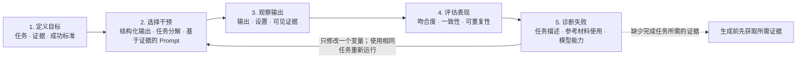

# 作业一：基于 Prompt Engineering 的动画重构

**语言：** 中文 | [English version](Specification.md)

## 作业目的

本作业考查你将 Prompt Engineering 作为一种受控、基于证据的工作方法加以运用的能力。
你需要利用 Prompt 和指定的视觉参考材料重构一段短动画，并通过过程记录说明每一次 Prompt 干预如何改变生成结果。
最终动画的质量很重要，但仅有精美结果、没有可检查的 Prompt Engineering 过程，不能满足本作业要求。

完成本作业后，你应能够：

1. 将视觉目标转化为可观察、可检查的成功标准；
2. 设计并测试受控的 Prompt 干预；
3. 保存模型输出，并在尽可能固定的条件下进行比较；
4. 诊断任务描述、参考材料使用以及模型控制方面的失败；
5. 清晰说明可复现的 Prompt 策略，并根据证据得出有边界的结论。

## 作业任务

根据所提供的六秒参考动画，生成一个高分辨率、具有金属质感的重构版本。
新动画应保留原动画的构图和动作顺序，同时使用参考图片所展示的高精度材质与视觉效果替代原动画的低分辨率外观。

目标场景包含两名无面部特征的人形角色。
他们在一个大型黑白太极图前，与深色和浅色球体进行互动。
太极图应在动画中保持稳定；两名角色应协调完成伸手、举起、传递、接取、下蹲，并逐步回到接近初始构图的一组动作。

你必须主要通过 Prompt 和生成服务所提供的控制参数完成任务。
你可以使用文本 Prompt、Negative Prompt、参考图片或参考视频条件、Prompt 权重、随机种子以及模型的标准设置。
允许的后期处理仅限于裁剪、循环、缩放、帧率转换和文件压缩。
不得以逐帧手工重绘、自行制作的 3D 替换动画或人工修改动作来代替本作业所考查的 Prompt Engineering 工作。

## 模型或服务的选择

你可以使用任何能够完成本任务的 LLM、生成式 AI 模型或在线服务。
本作业不指定或偏好任何供应商、模型或付费功能。
请尽量使用免费服务和免费额度；如果某项服务的免费额度不足，可以尝试其他免费服务。
我们不建议你仅为完成本作业购买额外额度或订阅服务。

评分关注的是你的 Prompt Engineering 工作方法、迭代证据，以及你在可用控制条件下实现的效果。
使用付费模型或服务本身不会获得额外分数。
你不需要为了数量而测试大量平台；只需在实际有帮助且可行的情况下探索多个免费选项。

## 提供的参考材料

| 参考材料 | 用途 |
| --- | --- |
| [动作参考动画](assets/motion-reference.gif) | 定义构图、两名角色的动作顺序、球体互动、时间节奏和循环方式。 |
| [太极图材质参考](assets/taijitu-material-reference.png) | 定义黑白太极图的几何形态、抛光材质、边缘、光照和阴影特征。 |
| [人形材质参考](assets/humanoid-material-reference.png) | 定义无面部特征的金属人形风格、身体比例、表面质感和光照反应。 |

动作和时间应以参考动画为准。
两张静态图片用于说明材质和外观，不能替代参考动画所要求的构图与动作。

## 最终动画要求

最终动画必须：

- 使用 1:1 正方形画面；
- 时长为 5-7 秒，并形成自然循环；
- 分辨率不低于 720 x 720；
- 帧率不低于每秒 12 帧；
- 在整个动画中保留两名可区分的人形角色；
- 保留大型太极图的几何形态、方向、画面位置以及黑白材质；
- 保留参考动画中的主要球体传递过程和整体动作顺序；
- 在不同帧之间保持合理的人体结构、脚部接地、手与球体接触、光照和阴影；
- 避免明显的人物变形、肢体重复、角色身份互换、背景漂移、物体闪烁和突兀的时间跳变。

最终动画应提交 MP4 或 WebM 文件。
只有在能够保留规定分辨率、时间和可见细节的情况下，才可提交 GIF。

## 必须采用的 Prompt Engineering 过程

整个作业过程必须遵循 M02 Prompt Engineering 控制循环。

每次报告的迭代都应遵循这一循环：定义成功标准，选择一项受控干预，保留输出，使用相同证据进行评估，诊断失败，然后只修改一个变量。

### 1. 定义目标

在开始生成之前，将任务分解为可检查的构图、动作、太极图形态与阴影、人形材质、时间一致性、循环质量和技术格式要求。
明确说明每项要求在什么情况下算成功，什么情况下算失败。

### 2. 选择干预

首先设计一个 Baseline Prompt，然后完成至少三次受控修改，总计提交至少四个 Prompt 版本。
每次修改应只改变一个 Prompt 变量，或一个边界清晰的 Prompt 模块，并在生成之前说明你预期它会产生什么效果。
可修改的内容包括动作分解、锁定背景的描述、接触约束、材质描述、相机约束或 Negative Prompt 模块。

在平台允许的情况下，一次对比实验中应保持生成工具、模型、时长、画面比例及其他设置不变。
如果平台提供随机种子控制，也应保持种子不变。
如果某项设置无法固定或查看，应将其记录为限制，不能声称这是完全受控的比较。
当免费额度或模型能力限制了后续工作时，你可以改用其他免费服务。
如果更换了模型或服务，必须记录这一变化，并且不能把结果差异仅仅归因于 Prompt。

### 3. 观察输出

每个提交版本都必须保存完整的 Prompt、Negative Prompt、参考输入、工具和模型名称、可见设置、随机种子（如有）以及原始输出。
先客观描述发生了什么变化，不要立即断言变化的原因。

每个版本都应检查动画时间轴上的五个相同位置：0%、25%、50%、75% 和 100%。
在每个检查点观察角色数量与位置、姿势与动作、球体接触、太极图稳定性、材质和阴影连续性，以及可见瑕疵。

### 4. 评估表现

使用相同的检查点和标准比较所有 Prompt 版本。
使用[中文 Prompt 记录模板](prompt-log-template-zh.md)中的评分尺度，为每个版本制作五个检查点的 Contact Sheet，并分析所修改的 Prompt 变量是否改善了目标表现、是否同时造成了其他退步。

### 5. 诊断并修改

对于失败或结果不一致的版本，判断最可能的失败类型：

- **任务描述失败：** Prompt 没有足够准确地定义任务或输出约束；
- **参考材料使用失败：** 模型获得了相关参考材料，但生成结果忽略、歪曲或不一致地使用了它；
- **能力或控制限制：** 所选择的模型或平台无法可靠地维持要求的时间或空间约束。

下一次修改应建立在诊断结果之上。
不要把所有差结果都简单归为 Prompt 不够好，也不要在证据只支持当前任务和当前生成设置时，声称某个 Prompt 在一般情况下更优秀。

## 必须提交的证据

提交材料必须包括：

1. **最终动画：** 质量最高的版本，使用允许的文件格式。
2. **过程报告：** 不超过 1,500 个英文单词或 2,500 个中文字符；Prompt、表格、图注和参考文献不计入限制。
3. **Prompt 记录：** 使用模板记录 Baseline 和至少三次受控修改，并逐字保留每个 Prompt。
4. **迭代证据：** 每个报告版本的原始动画，以及对应的五检查点 Contact Sheet。
5. **最终对比：** 以相同尺寸和对齐时间展示动作参考动画与最终结果，并进行基于证据的自我评价。
6. **工具披露：** 记录生成平台、可见的模型或模型版本、设置、随机种子（如有）、参考输入和所有允许的后期处理。

报告应简洁并以分析为主。
重点解释你的决策、测量、失败和有证据支持的结论，而不是逐项描述点击操作。

## 教学班专属提交信息

作业形式、课程占比、截止日期、提交渠道、邮件 Subject 和文件命名规则由采用本作业的具体教学班页面规定。
这些本地信息不属于本可复用的任务 Specification。

## 评分方式

| 评分项目 | 在本作业中的占比 |
| --- | ---: |
| 目标定义与可观察的成功标准 | 10% |
| 受控的 Prompt 干预 | 20% |
| 一致的观察与评估 | 12% |
| 失败诊断与基于证据的反思 | 8% |
| 最终动画质量 | 45% |
| 可复现性与负责任的工具披露 | 5% |

最终动画质量包括动作与原动画的吻合度、太极图几何形态和阴影的准确度、人体动作的协调性、金属材质一致性、时间稳定性、循环质量和技术呈现。

## 负责任使用

请遵守你所在教学班规定的个人或小组作业要求。
生成式 AI 是本作业规定的制作媒介，因此使用生成式 AI 本身不构成不当行为。
你必须披露所使用的工具和模型输出；如果 Prompt 文字或技巧来自其他来源，应注明来源；同时保留足够的原始证据，以便教学团队检查你的工作过程。

除本作业提供的参考材料外，不得向生成服务上传任何隐私、机密、个人或未经授权的版权材料。
不得在 Prompt、截图、报告或提交文件中包含 API Key、Access Token 或账户密码。
