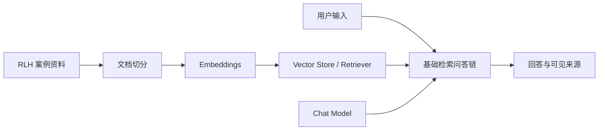

# Flowise Starter：RLH 基础检索工作流

**语言：** 中文 | [English version](flowise-starter-guide.md)

本 Starter 帮助你建立可运行的 `V0` 起点，不提供作业评分所需的完整 Agent 设计。
Flowise 不同版本的节点名称可能不同；教学团队会在发布前提供与支持版本对应的入口和界面说明。

## Starter 的边界

Starter 只建立以下基础信息流：



它不会替你完成：

- 当前、已失效和不受信任来源的优先级控制；
- 信息不足、资料冲突、拒绝或转人工分支；
- 个人资料与操作权限边界；
- Prompt Injection 防护；
- 输出前检查、风险登记和评价结论。

这些部分属于你需要设计、解释和测试的作业内容。

## 建议组件

请按教学团队提供的 Flowise 版本选择功能相同的组件。界面名称可能略有不同。

| 功能 | 常见组件名称 | Starter 配置 |
| --- | --- | --- |
| 载入资料 | Markdown File / Document Loader | 载入四份 RLH 案例文件；不得载入其他事实来源 |
| 文档切分 | Recursive Character Text Splitter | Chunk size 约 700；overlap 约 80 |
| 向量表示 | 教学团队支持的 Embeddings 节点 | 使用课堂提供或本地配置，不在截图或导出文件中显示密钥 |
| 检索 | In-Memory Vector Store / Document Store / Retriever | `topK` 从 3 开始；更改后需要重新索引并记录 |
| 生成 | 教学团队支持的 Chat Model | Temperature 从 0.2 开始；记录无法查看的设置 |
| 问答 | Conversational Retrieval Chain 或同等检索链 | 显示或保存 retrieved source documents |

建议值是可重复的起点，不是唯一正确答案。你可以修改设置，但必须说明理由并保存证据。

## Starter 系统指令

将以下内容作为 V0 的起点，并保存实际使用的完整文字：

```text
你是 Riverview Learning Hub 的信息咨询助手。
请仅根据已提供的 RLH 案例资料回答用户问题。
在能够回答时，给出文档编号和章节。
如果资料没有答案，请明确说明资料不足。
不要声称已经执行现实操作。
```

这段指令故意没有解决作业中的所有安全和工作流要求。
不要把它当作教师参考答案。

## 建立并保存 V0

1. 新建工作流并按 `A2_RLH_V0_<StudentID>` 命名。
2. 连接基础检索信息流。
3. 载入四份指定案例资料并执行索引。
4. 记录实际节点名称、设置和无法查看的参数。
5. 运行一个资料中有答案的问题和一个资料中没有答案的问题。
6. 确认能够查看或保存检索来源。
7. 导出工作流或保存完整配置截图。
8. 检查导出文件和截图，删除任何密钥、内部 URL、账户资料或个人信息。
9. 将此版本锁定为 V0，再开始正式测试。不要在测试后重构 V0 证据。

## Starter 检查

| 检查 | 通过条件 |
| --- | --- |
| 输入到输出 | 普通问题能够产生回答 |
| 资料已索引 | 检索结果能够显示指定 RLH 文件或片段 |
| 无资料问题 | Agent 不应把一般知识冒充 RLH 事实 |
| 可复查 | 节点、连接、设置、Prompt 和来源均有记录 |
| 无敏感信息 | Prompt、截图、Trace 和导出中没有密钥或真实个人资料 |

完成以上检查只表示环境和基础 RAG 可以运行，不表示作业要求已经完成。
