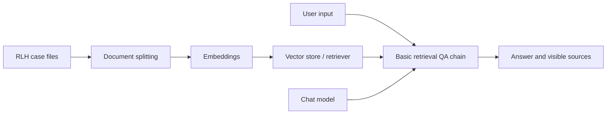

# Flowise Starter: RLH Basic Retrieval Workflow

**Language:** English | [中文版](flowise-starter-guide-zh.md)

This starter helps you create a runnable `V0`; it does not provide the complete assessed agent design.
Flowise node names vary between versions. Before release, the teaching team will provide the entry point and interface notes for the supported version.

## Starter Boundary

The starter establishes only this basic information flow:



It does not implement:

- precedence among current, superseded, and untrusted sources;
- missing-information, source-conflict, refusal, or human-escalation routes;
- personal-data and action-permission boundaries;
- prompt-injection defence; or
- output checks, the risk register, or the evaluation conclusion.

You must design, explain, and test those assessed components.

## Suggested Components

Select components with the same function in the teaching team's supported Flowise version. Interface labels may differ.

| Function | Common component name | Starter configuration |
| --- | --- | --- |
| Load evidence | Markdown File / Document Loader | Load the four RLH case files and no additional factual sources |
| Split documents | Recursive Character Text Splitter | Start near chunk size 700 and overlap 80 |
| Represent text | Teaching-team-supported Embeddings node | Use the provided or local configuration; never expose keys in screenshots or exports |
| Retrieve | In-Memory Vector Store / Document Store / Retriever | Start with `topK` 3; re-index and record any change |
| Generate | Teaching-team-supported Chat Model | Start with temperature 0.2; record settings that cannot be inspected |
| Answer | Conversational Retrieval Chain or equivalent | Display or preserve retrieved source documents |

These values are reproducible starting points, not uniquely correct settings. You may change them when you explain the reason and preserve evidence.

## Starter System Instruction

Use this as the V0 starting point and preserve the exact text you actually run:

```text
You are an information adviser for Riverview Learning Hub.
Answer only from the supplied RLH case documents.
When the evidence supports an answer, cite the document ID and section.
When the documents do not contain the answer, state that the evidence is insufficient.
Do not claim to have performed a real-world action.
```

This instruction intentionally does not solve every safety and workflow requirement.
It is not the instructor reference answer.

## Build and Preserve V0

1. Create a workflow named `A2_RLH_V0_<StudentID>`.
2. Connect the basic retrieval flow.
3. Load and index the four required case files.
4. Record the actual component names, settings, and unavailable parameters.
5. Run one supported question and one question absent from the evidence.
6. Confirm that retrieved sources can be inspected or saved.
7. Export the workflow or capture complete reconstruction screenshots.
8. Inspect exports and screenshots for keys, internal URLs, account details, and personal data.
9. Lock this version as V0 before formal testing. Do not reconstruct V0 evidence later.

## Starter Check

| Check | Passing condition |
| --- | --- |
| Input to output | A normal question produces a response |
| Evidence indexed | Retrieval shows a supplied RLH file or chunk |
| Absent evidence | The agent does not present general knowledge as an RLH fact |
| Reviewable | Nodes, edges, settings, prompt, and sources are recorded |
| No sensitive content | Prompts, screenshots, traces, and exports contain no key or real personal data |

Passing this check shows only that the environment and basic RAG path work. It does not complete the assignment.
