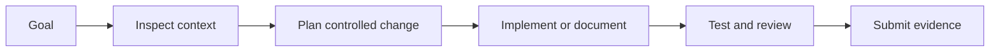

# FLIP: Agentic AI in Practice
**(Module 08: Advanced Agentic AI)**

---

## Session 8B: Codex Codebase Understanding and Development

### 1. Overview

This session teaches how to use a coding agent to inspect a codebase, plan a small change, and implement or document it safely.

This handout follows the same structure as the notebooks: conceptual background, controlled workflow, safety boundary, practical steps, testing and reflection. It is Markdown rather than a notebook because the session focuses on codebase understanding, planning, productisation and documentation.



### 2. Core Concepts

<div align="center">

<table>
<thead>
<tr><th><strong>Concept</strong></th><th><strong>Meaning in this session</strong></th></tr>
</thead>
<tbody>
<tr><td align="left">Context boundary</td><td>Use only approved repository files and public materials.</td></tr>
<tr><td align="left">Plan before action</td><td>Describe what will be changed before changing it.</td></tr>
<tr><td align="left">Traceability</td><td>Keep evidence of files inspected, decisions made and tests run.</td></tr>
<tr><td align="left">Human review</td><td>Do not treat an agent output as automatically correct.</td></tr>
</tbody>
</table>

</div>

### 3. Practical Workflow

```text
1. Read the task carefully.
2. Identify the allowed files and data.
3. Write a short plan.
4. Make the smallest safe change.
5. Run checks or create a review checklist.
6. Document limitations and unresolved issues.
```

### 4. Student Tasks

<div align="center">

<table>
<thead><tr><th><strong>Task</strong></th><th><strong>Evidence</strong></th></tr></thead>
<tbody>
<tr><td align="left">Choose a small repository task.</td><td>Task description and allowed files.</td></tr>
<tr><td align="left">Ask the agent to inspect before editing.</td><td>Summary of inspected files.</td></tr>
<tr><td align="left">Request a staged implementation plan.</td><td>Plan with phases and confirmation points.</td></tr>
<tr><td align="left">Run or propose tests.</td><td>Test output or checklist.</td></tr>
</tbody>
</table>

</div>

### 5. Submission

Submit:

```text
1. Your plan.
2. Files or sections inspected.
3. Changes made or proposed.
4. Tests/checks completed.
5. Reflection on safety, limitations and next steps.
```

### 6. Further Readings

- GitHub documentation: <https://docs.github.com/>
- Codex-style coding-agent workflows: <https://platform.openai.com/docs/>
- LangGraph documentation: <https://langchain-ai.github.io/langgraph/>
