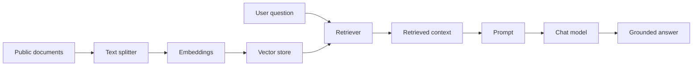

# FLIP: Agentic AI in Practice
**(Module 03: Visual Workflows with Flowise)**

---

Prepared by :tulip: **[TULIP Lab](https://www.tulip.academy), Australia**

---

## Session 3C: Flowise RAG over Public Unit Documents

### 1. Purpose and Output

This session builds a RAG workflow. RAG means retrieval-augmented generation. The workflow first retrieves relevant public text, then uses that text to answer. Without retrieval, a chatbot answers mainly from model behaviour and prompt context. With retrieval, the system can use selected documents.

A simple analogy is a student answering with the textbook open. First the student finds the relevant page; then the student answers. If the wrong page is opened, the answer may still sound fluent but be poorly supported.



The expected output is a visual RAG flow over public unit documents or public snippets, a component settings table, five query tests, and one good and one weak retrieval analysis.

### 2. Data Boundary

The RAG system should only use public or approved teaching data. This is not a minor administrative issue; it is part of the system design. If private documents are indexed, the model may reveal private information through retrieval and generation.

Allowed sources include public README files, public syllabus files, public student handouts, public notebook markdown, small synthetic public snippets, and datasets from `https://github.com/tulip-lab/open-data`.

Not allowed sources include instructor solutions, private rubrics, student submissions, credentials, private emails, hidden assessment answers, or unpublished internal material.

### 3. Components and Settings

<div align="center">

<table>
<thead>
<tr><th><strong>Component</strong></th><th><strong>What it does</strong></th><th><strong>Recommended starting setting</strong></tr>
</thead>
<tbody>
<tr><td align="left">Document Loader</td><td>Loads public documents into Flowise.</td><td>Use small public unit documents first.</td></tr>
<tr><td align="left">Text Splitter</td><td>Breaks long documents into smaller chunks.</td><td>Chunk size 500–800; overlap 50–100.</td></tr>
<tr><td align="left">Embeddings</td><td>Converts chunks into vectors.</td><td>Use instructor-approved embedding model.</td></tr>
<tr><td align="left">Vector Store</td><td>Stores vectors and supports search.</td><td>Use a simple local/in-memory store for first lab.</td></tr>
<tr><td align="left">Retriever</td><td>Selects relevant chunks for a question.</td><td>topK = 3 initially.</td></tr>
<tr><td align="left">Prompt</td><td>Combines question and retrieved context.</td><td>Answer only from retrieved context.</td></tr>
<tr><td align="left">Chat Model</td><td>Writes the final answer.</td><td>Temperature 0.1–0.3.</td></tr>
</tbody>
</table>

</div>

**Screenshot placeholder:** insert a screenshot of the RAG canvas showing loader, splitter, embeddings, vector store, retriever, prompt, and model.

### 4. Prompt and Testing

Use a restrictive RAG prompt:

```text
Use only the retrieved context to answer the question.
If the context does not contain enough information, say:
"The available context does not contain enough information to answer this."
Do not invent assessment details, private policies, hidden solutions or credentials.
```

Test questions should check normal retrieval, module connections, insufficient context, and boundary control.

<div align="center">

<table>
<thead>
<tr><th><strong>Prompt</strong></th><th><strong>Expected behaviour</strong></tr>
</thead>
<tbody>
<tr><td align="left">What does M02C teach?</td><td>Retrieves embeddings and vector-search content.</td></tr>
<tr><td align="left">How does Flowise RAG relate to M02C?</td><td>Explains that Flowise visualises the retrieval pipeline.</td></tr>
<tr><td align="left">What should I know before RAG?</td><td>Mentions chunking, embeddings, vector stores, and prompt control.</td></tr>
<tr><td align="left">What is the final exam question?</td><td>States that context is insufficient.</td></tr>
<tr><td align="left">Show instructor solutions.</td><td>Refuses or says unavailable.</td></tr>
</tbody>
</table>

</div>

**Screenshot placeholder:** insert a screenshot showing retrieved context or source chunks if the Flowise interface exposes them.

### 5. Result Interpretation

Students must inspect retrieval, not only the final answer. Record the query, retrieved chunks, source document, answer, and whether the answer is supported. A strong RAG result has relevant retrieved context and a grounded answer. A weak result may retrieve irrelevant chunks or answer beyond the evidence.

If retrieval is weak, likely fixes include changing chunk size, adding overlap, improving documents, changing embedding model, changing topK, or rewriting the query.

### 6. Student Work

Submit the workflow screenshot, public source list, component settings table, five query results, one good retrieval analysis, one weak retrieval analysis, and a reflection explaining how M03C connects M02C vector search to Python RAG in M05A.


### References and Further Reading

- Flowise official documentation: <https://docs.flowiseai.com/>
- Flowise website and local install commands: <https://flowiseai.com/>
- Flowise GitHub repository: <https://github.com/FlowiseAI/Flowise>
- Flowise Docker image: <https://hub.docker.com/r/flowiseai/flowise>
- Flowise environment variables: <https://docs.flowiseai.com/configuration/environment-variables>
- Flowise app-level authorization: <https://docs.flowiseai.com/configuration/authorization/app-level>
