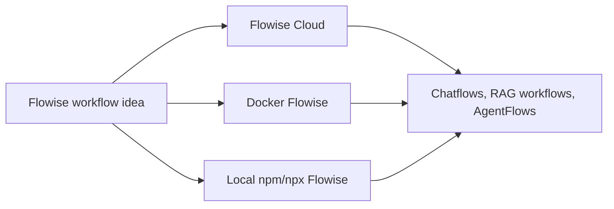

# FLIP: Agentic AI in Practice
**(Module 03: Visual Workflows with Flowise)**

---

Prepared by :tulip: **[TULIP Lab](https://www.tulip.academy), Australia**

---

## M03X: Flowise Environment, Docker Setup, API Keys and Credentials

### 1. Purpose

M03X is a prerequisite session. Complete it before M03A. The goal is to make the Flowise environment understandable before students begin building workflows. Students should know what Flowise Cloud is, what Docker Flowise is, what local npm/npx Flowise is, which one they are using, which API keys are needed, and where credentials should be stored.

Flowise can be understood as a visual workshop for AI applications. Instead of writing the whole application in code, students connect visible blocks. A block may represent a prompt, model, embedding model, vector store, retriever, memory component, or tool. The arrows between blocks show how information moves.



The key point is that the learning concepts remain the same across the three modes. What differs is hosting, persistence, authentication, credentials, access control, and deployment responsibility.

### 2. Flowise Cloud, Docker Flowise and Local Flowise

Flowise Cloud is the managed online version. Students open `https://cloud.flowiseai.com/chatflows`, sign in, and build workflows through the browser. This is the fastest path for classroom use because students do not need to install Docker or Node.js. It is appropriate when the learning focus is visual workflow design, not infrastructure. The caution is that uploaded data, saved workflows, and credentials are handled inside a cloud workspace. Students must not upload private files, instructor-only materials, real student submissions, or secret API keys outside the credential manager.

Docker Flowise runs Flowise inside a container on a local machine, lab machine, or cloud VM. This is better when the instructor wants a reproducible environment or when the class needs to discuss deployment and persistence. Docker makes the runtime more explicit: students can see the container, port mapping, environment variables, logs, and persistent volume. It is slightly more technical but more operationally realistic.

Local npm/npx Flowise runs directly through Node.js. It is useful for developers who already have Node.js installed and want a quick local experiment. It is less ideal for a large class because different students may have different Node.js versions and package states.

<div align="center">

<table>
<thead>
<tr><th><strong>Mode</strong></th><th><strong>Typical address</strong></th><th><strong>Best use</strong></th><th><strong>Main caution</strong></th></tr>
</thead>
<tbody>
<tr><td align="left">Flowise Cloud</td><td><code>https://cloud.flowiseai.com/chatflows</code></td><td>Fast classroom start; no local setup.</td><td>Cloud workspace, uploaded data, quota and credentials need care.</td></tr>
<tr><td align="left">Docker Flowise</td><td><code>http://localhost:3000</code></td><td>Reproducible lab setup and deployment discussion.</td><td>Requires Docker, port, volume and password management.</td></tr>
<tr><td align="left">Local npm/npx Flowise</td><td><code>http://localhost:3000</code></td><td>Quick individual experimentation.</td><td>Depends on local Node.js and package environment.</td></tr>
</tbody>
</table>

</div>

**Screenshot placeholder:** insert a screenshot of the Flowise Cloud Chatflows dashboard here. It should show the Chatflows list and the “new flow” or equivalent button. Blur account name, workspace name, private URLs, and any usage/billing details.

**Screenshot placeholder:** insert a screenshot of Docker/local Flowise opened at `http://localhost:3000`. It should demonstrate that the interface is conceptually similar to Flowise Cloud.

### 3. Docker Setup

For Docker, first install Docker Desktop on macOS/Windows or Docker Engine on Linux. Confirm that Docker is ready:

```bash
docker --version
docker compose version
```

Create a folder for the lab:

```bash
mkdir flowise-lab
cd flowise-lab
```

Create a `.env` file. This keeps configuration outside the compose file.

```bash
cat > .env <<'EOF'
PORT=3000
FLOWISE_USERNAME=admin
FLOWISE_PASSWORD=change_this_password
EOF
```

Do not commit `.env` to GitHub. It may contain secrets or passwords.

Create `docker-compose.yml`:

```yaml
services:
  flowise:
    image: flowiseai/flowise:latest
    container_name: flowise
    restart: unless-stopped
    ports:
      - "${PORT}:3000"
    environment:
      - PORT=3000
      - FLOWISE_USERNAME=${FLOWISE_USERNAME}
      - FLOWISE_PASSWORD=${FLOWISE_PASSWORD}
      - DATABASE_PATH=/root/.flowise
      - APIKEY_PATH=/root/.flowise
      - SECRETKEY_PATH=/root/.flowise
      - LOG_PATH=/root/.flowise/logs
      - BLOB_STORAGE_PATH=/root/.flowise/storage
    volumes:
      - flowise_data:/root/.flowise
    command: flowise start

volumes:
  flowise_data:
```

Start Flowise:

```bash
docker compose up -d
```

Open:

```text
http://localhost:3000
```

Check logs:

```bash
docker logs -f flowise
```

Stop the service:

```bash
docker compose stop
```

The persistent volume is important. Without a persistent volume, saved workflows and credentials may disappear when containers are removed. For a school or university lab, Docker setup should be tested by the instructor before class.

### 4. Local npm/npx Setup

Local npm/npx setup is shorter but depends on Node.js:

```bash
npm install -g flowise
npx flowise start
```

Open:

```text
http://localhost:3000
```

This is acceptable for individual experiments. For teaching at scale, Flowise Cloud or Docker is usually easier to support.

### 5. API Keys and Credentials

An API key is a secret token that allows Flowise to call an external AI service. Students should think of it like a password. It should never appear in Markdown files, screenshots, GitHub commits, prompt text, exported workflows, or chat messages.

M03 uses two kinds of model capability: chat generation and embeddings. Chat generation writes an answer. Embeddings convert text into vectors for retrieval. Some providers support both; some are mainly used for chat.

<div align="center">

<table>
<thead>
<tr><th><strong>Session</strong></th><th><strong>Likely requirement</strong></th><th><strong>Reason</strong></th></tr>
</thead>
<tbody>
<tr><td align="left">M03A</td><td>No key required for interface practice.</td><td>Students can inspect the canvas without running a model.</td></tr>
<tr><td align="left">M03B</td><td>Chat model API key.</td><td>The chatbot must call a model to answer.</td></tr>
<tr><td align="left">M03C</td><td>Chat model API key and embedding API key.</td><td>RAG needs generated answers and vector representations.</td></tr>
<tr><td align="left">M03D</td><td>Chat model API key.</td><td>The agent needs a model to decide whether a tool should be used.</td></tr>
<tr><td align="left">M03E</td><td>No new key by default.</td><td>The focus is reviewing access, embed and API exposure.</td></tr>
</tbody>
</table>

</div>

Common provider pages are:

<div align="center">

<table>
<thead>
<tr><th><strong>Provider</strong></th><th><strong>Key page</strong></th><th><strong>Typical use</strong></tr>
</thead>
<tbody>
<tr><td align="left">OpenAI</td><td><code>https://platform.openai.com/settings/organization/api-keys</code></td><td>Chat and embeddings.</td></tr>
<tr><td align="left">Google Gemini</td><td><code>https://aistudio.google.com/app/apikey</code></td><td>Chat; embeddings if supported by selected Flowise node.</td></tr>
<tr><td align="left">Anthropic</td><td><code>https://platform.claude.com/</code></td><td>Chat model.</td></tr>
<tr><td align="left">Groq</td><td><code>https://console.groq.com/keys</code></td><td>Fast chat model access where supported.</td></tr>
<tr><td align="left">Ollama</td><td>Local installation, no cloud API key.</td><td>Local/private model exploration in later sessions.</td></tr>
</tbody>
</table>

</div>

In Flowise, open Credentials, choose the relevant provider, paste the API key into the credential field, and save it with a clear name such as `unit-openai-key`. Then select that saved credential inside the Chat Model or Embeddings node. This keeps secret values out of the visible workflow.

**Screenshot placeholder:** insert a screenshot of the Credentials screen here. It should show where credentials are created and selected, but no key value should be visible.

### 6. Component Map for Module 03

The module increases complexity gradually. M03A is about the canvas. M03B adds controlled chat. M03C adds retrieval. M03D adds action through tools. M03E reviews whether the workflow is safe to expose through an embed widget or API.

<div align="center">

<table>
<thead>
<tr><th><strong>Session</strong></th><th><strong>Main components</strong></th><th><strong>Key settings to check</strong></tr>
</thead>
<tbody>
<tr><td align="left">M03A</td><td>Chatflows page, canvas, optional chat model.</td><td>Runtime mode, workflow name, credential location.</td></tr>
<tr><td align="left">M03B</td><td>Chat input, prompt/system instruction, chat model, optional memory.</td><td>Model, credential, temperature, memory, system instruction.</td></tr>
<tr><td align="left">M03C</td><td>Document loader, text splitter, embeddings, vector store, retriever, prompt, chat model.</td><td>Document source, chunk size, overlap, topK, embedding model, data boundary.</td></tr>
<tr><td align="left">M03D</td><td>AgentFlow input, instruction, model/router, approved tool, output.</td><td>Allowed tool, schema, validation rules, refusal behaviour.</td></tr>
<tr><td align="left">M03E</td><td>Embed widget, Prediction API, access control, logs/history, usage limits.</td><td>Public/private access, API protection, disclaimer, data and tool safety.</td></tr>
</tbody>
</table>

</div>

### 7. Completion Criteria

Before M03A, students should be able to answer these questions in plain language:

```text
Which Flowise runtime am I using?
How do I open the dashboard?
Do I need a chat model key today?
Do I need an embedding key today?
Where are credentials stored?
What should never appear in screenshots?
```

If these answers are clear, the student is ready for M03A.


### References and Further Reading

- Flowise official documentation: <https://docs.flowiseai.com/>
- Flowise website and local install commands: <https://flowiseai.com/>
- Flowise GitHub repository: <https://github.com/FlowiseAI/Flowise>
- Flowise Docker image: <https://hub.docker.com/r/flowiseai/flowise>
- Flowise environment variables: <https://docs.flowiseai.com/configuration/environment-variables>
- Flowise app-level authorization: <https://docs.flowiseai.com/configuration/authorization/app-level>
