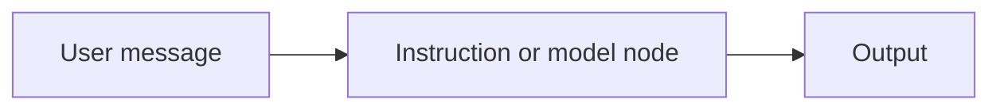
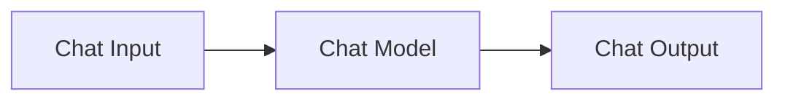

# FLIP: Agentic AI in Practice
**(Module 03: Context Engineering and Agent Orchestration)**

---

Prepared by :tulip: **[TULIP Lab](https://www.tulip.academy), Australia**

---

## Session 3A: Flowise Interface and First Chatflow

### 1. Purpose and Output

This session introduces the Flowise canvas. Students create a first chatflow, inspect the interface, and explain how information moves from user input to model output. The objective is not to build a sophisticated chatbot yet. The objective is to learn how to read a visual AI workflow.

A useful way to think about Flowise is to imagine a machine drawn on paper. The message enters from the left, moves through boxes, and an answer comes out on the right. The boxes are workflow components. The arrows show information flow.



Rather than memorising terms such as “node” and “edge” separately, focus on the whole picture. A node is just one box in the workflow. An edge is just the connection that sends information to the next box. This visual view will become more valuable when the workflow contains retrieval, memory, tools, and deployment settings.

### 2. Building the First Chatflow

Open Flowise using the runtime chosen in M03X. In Flowise Cloud, open the Chatflows page. In Docker or local mode, open `http://localhost:3000`.

Create a new chatflow named:

```text
M03A_First_Chatflow_YourName
```

The first flow can be simple:



If the model credential is already configured, run a simple test prompt. If the credential is not ready, still create the workflow structure and inspect the node settings. A non-running workflow can still teach the layout and component logic.

**Screenshot placeholder:** insert a screenshot of the first chatflow canvas here. It should show the flow name and the connected components. Hide any private workspace details.

### 3. Component Settings to Inspect

When students click a node, they should inspect its settings rather than treating it as a black box. A model node may include provider name, model name, credential selector, temperature, maximum output length, and advanced settings. Students do not need to change all of these, but they should know that they exist.

<div align="center">

<table>
<thead>
<tr><th><strong>Setting</strong></th><th><strong>What it means</strong></th><th><strong>Why it matters</strong></tr>
</thead>
<tbody>
<tr><td align="left">Provider/model</td><td>The AI service and model used.</td><td>Different models may give different quality, cost, and speed.</td></tr>
<tr><td align="left">Credential</td><td>The saved API key reference.</td><td>The workflow can call the model without exposing the secret.</td></tr>
<tr><td align="left">Temperature</td><td>Controls randomness.</td><td>Lower values are usually better for stable teaching assistants.</td></tr>
<tr><td align="left">Input and output handles</td><td>Where data enters and leaves the node.</td><td>Shows how to connect the workflow correctly.</td></tr>
</tbody>
</table>

</div>

### 4. Result Interpretation

A successful M03A result means the environment works, the workflow is saved, and students understand the basic visual structure. It does not prove that the chatbot is safe, accurate, or useful. Those qualities depend on prompt design, data grounding, testing, and deployment controls in later sessions.

If the model runs, test:

```text
Say hello and explain in one sentence what this workflow does.
```

A suitable answer should be short and should describe the workflow as a simple chatflow. If the call fails, the most likely issue is missing credentials or a wrong provider setting.

### 5. Student Work

Submit the runtime mode, workflow name, screenshot, and a short explanation of the information flow. The reflection should explain how a visual workflow makes an AI application easier to understand before implementing similar logic in LangChain or LangGraph.


### References and Further Reading

- Flowise official documentation: <https://docs.flowiseai.com/>
- Flowise website and local install commands: <https://flowiseai.com/>
- Flowise GitHub repository: <https://github.com/FlowiseAI/Flowise>
- Flowise Docker image: <https://hub.docker.com/r/flowiseai/flowise>
- Flowise environment variables: <https://docs.flowiseai.com/configuration/environment-variables>
- Flowise app-level authorization: <https://docs.flowiseai.com/configuration/authorization/app-level>
