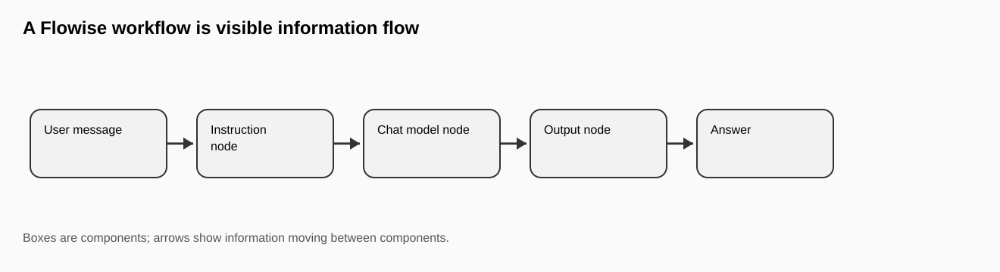
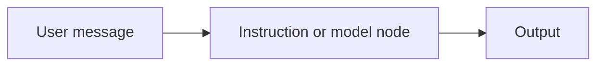
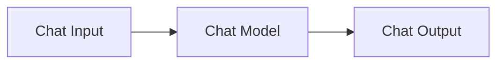
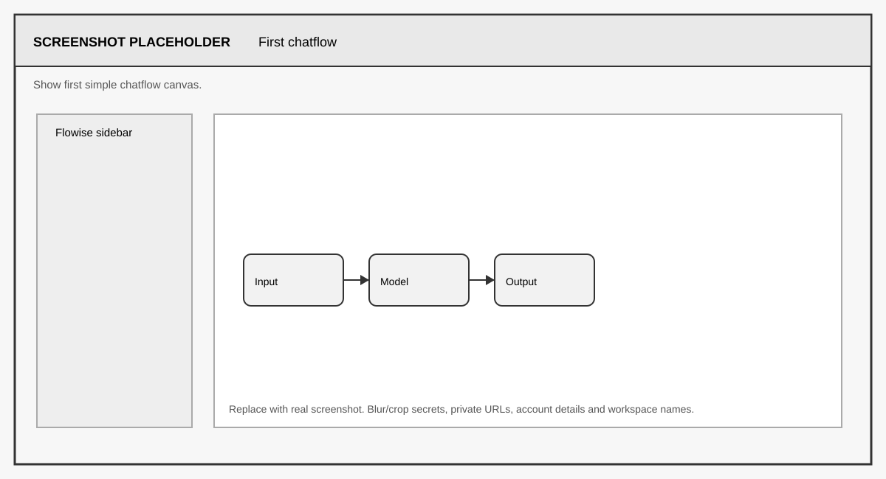
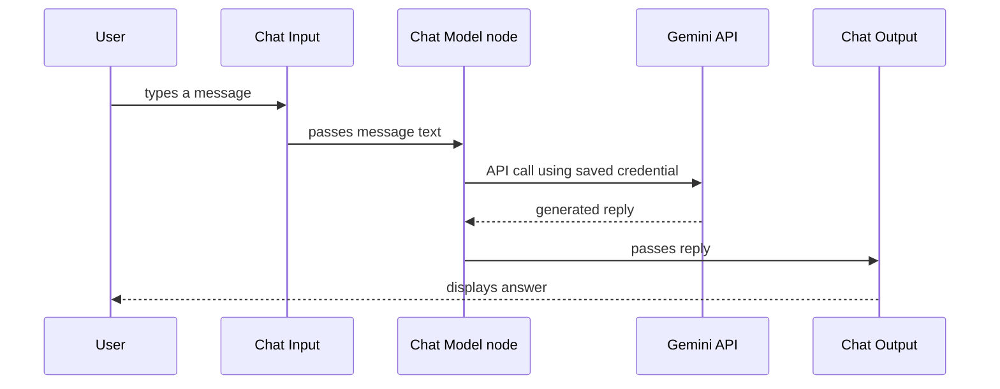

# FLIP: Agentic AI in Practice
**(Module 03: Context Engineering and Agent Orchestration)**

---

Prepared by :tulip: **[TULIP Lab](https://www.tulip.academy), Australia**

---

## Session 3A: Flowise Interface and First Chatflow

[← Module 03 study guide](../README.md) · [Previous: M03X](M03X-Flowise-Environment-Setup.md) · [Next: M03B](M03B-Flowise-Chatbot-Prompt-Memory.md)

| Estimated time | Prerequisites | Main evidence |
|---|---|---|
| 45–60 minutes | M03X complete; a model credential is optional for interface-only study | Saved flow, settings record, three tests, and an information-flow explanation |

### 1. Overview and Learning Goals

This session introduces the Flowise canvas. You will create a first chatflow, inspect the interface, and explain how information moves from user input to model output. The objective is not to build a sophisticated chatbot yet. The objective is to learn how to read a visual AI workflow, because every later session — RAG in M03C, agents in M03D, deployment in M03E — is built by reading and editing exactly this kind of diagram.

By the end, you should be able to:

- identify a node, edge, input handle, output handle, and model setting;
- narrate how one user message becomes one model response;
- distinguish a connected workflow from a merely arranged set of nodes; and
- test normal, missing-information, and secret-request cases.



A useful way to think about Flowise is to imagine a machine drawn on paper. The message enters from the left, moves through boxes, and an answer comes out on the right. The boxes are workflow components. The arrows show information flow.



Rather than memorising terms such as "node" and "edge" separately, focus on the whole picture. A node is just one box in the workflow — it does one job, such as receiving a message or calling a model. An edge is just the connection that sends information to the next box. When you can look at a canvas and narrate what happens to a message step by step, you have achieved the goal of this session. That reading skill becomes more valuable when the workflow contains retrieval, memory, tools, and deployment settings.

Before starting, complete M03X. You need a working Flowise runtime (Cloud, Docker, or local). No API key is strictly required for this session — you can build and inspect the workflow without running it — but if you already saved a Google Gemini credential in M03X, you will also be able to test the flow live. All key-safety rules from M03X Section 5 apply here: no key value may appear in any screenshot or exported file.

### 2. Build the First Chatflow

Open Flowise using the runtime chosen in M03X. In Flowise Cloud, sign in and open the Chatflows page. In Docker or local mode, open `http://localhost:3000` and log in. Either way, you should see the Chatflows dashboard: a list of saved workflows (empty at first) and a button to add a new one.

Click **Add New** to create a chatflow, then name it using this pattern so your work is identifiable in a shared workspace and in your submission:

```text
M03A_First_Chatflow_YourName
```

The name matters more than it looks: unnamed flows called "Untitled" pile up quickly in classroom workspaces, and your submission asks for the exact workflow name. Save the empty flow once (the save icon in the top bar) so the name is recorded before you start adding nodes.

The first flow can be simple:



Now build it. On the canvas, open the node palette (the **+** button), and search for the nodes you need. Flowise groups nodes by category, and the exact assembly differs slightly between Flowise versions: in most current versions, you add a *Conversation Chain* or a simple *LLM Chain* which already carries the input and output behaviour, and then attach a *Chat Model* node to it — for this unit, choose the **ChatGoogleGenerativeAI** (Gemini) node. Drag each node onto the canvas, then connect them by dragging from the small circle (the output handle) on one node to the matching input handle on the next. Flowise only lets you connect compatible handles, so if a connection refuses to attach, you are joining the wrong pair — hover over the handles to read their expected types.

In the Chat Model node, select your saved credential (for example `unit-gemini-key` from M03X) from the credential dropdown, and choose an instructor-approved model that is available in your account. Model names and availability change, so prefer the in-app dropdown over copying a model name from an older screenshot. Set temperature to `0.2`; low temperature keeps answers stable, which makes classroom results comparable. Save the flow again.

Three things can happen at this point, and all three are instructive. If the credential is configured correctly, the flow is runnable and you can test it in the next section. If you have no credential yet, the flow will show a warning on the model node — you can still inspect every setting, and a non-running workflow still teaches the layout and component logic. If the nodes will not connect at all, check that you are using a chain node compatible with your chat model node; mixing node types from different workflow families is the most common first-lab error.

<div align="center">

<table>
<thead>
<tr><th><strong>Node</strong></th><th><strong>Role in the flow</strong></th><th><strong>Recommended setting</strong></th></tr>
</thead>
<tbody>
<tr><td align="left">Conversation / LLM Chain</td><td>Carries the message from input to model and back to output.</td><td>Default settings.</td></tr>
<tr><td align="left">Chat Model (Gemini)</td><td>Generates the reply.</td><td>Credential <code>unit-gemini-key</code>; an available instructor-approved model; temperature 0.2.</td></tr>
</tbody>
</table>

</div>



> **Checkpoint — read the canvas aloud:** “The chain receives the chat message, calls the connected chat model using a saved credential, and returns the generated text.” If you cannot point to each part while saying this, inspect the connections before testing.

### 3. Component Settings to Inspect

When you click a node, inspect its settings rather than treating it as a black box. A model node includes a provider and model name, a credential selector, a temperature slider, a maximum output length, and advanced settings. You do not need to change all of these today, but you should know that they exist and roughly what each one does, because from M03B onward you will be asked to justify your parameter choices.

<div align="center">

<table>
<thead>
<tr><th><strong>Setting</strong></th><th><strong>What it means</strong></th><th><strong>Why it matters</strong></th></tr>
</thead>
<tbody>
<tr><td align="left">Provider/model</td><td>The AI service and model used.</td><td>Different models give different quality, cost, and speed.</td></tr>
<tr><td align="left">Credential</td><td>The saved API key reference.</td><td>The workflow can call the model without exposing the secret.</td></tr>
<tr><td align="left">Temperature</td><td>Controls randomness of generation.</td><td>Lower values (0–0.3) give stable, repeatable answers; higher values give varied, creative ones.</td></tr>
<tr><td align="left">Max output tokens</td><td>Upper limit on reply length.</td><td>Caps cost and prevents runaway long answers.</td></tr>
<tr><td align="left">Input and output handles</td><td>Where data enters and leaves the node.</td><td>Shows how to connect the workflow correctly.</td></tr>
</tbody>
</table>

</div>

While you inspect, trace the runtime story of a single message through the connected nodes. This is the mental model you should carry into every later session:



Notice that the secret key never travels through the canvas: the model node holds only a credential reference, and Flowise attaches the real key server-side when it makes the API call. That is why a screenshot of your canvas is safe to submit, while a screenshot of the Credentials creation dialog would not be.

> **Evidence checkpoint:** capture your own model-settings screenshot showing the model name, credential name only, and temperature. Before saving it, scan the entire image for key values, account details, private URLs, and unrelated flows.

### 4. Result Interpretation

A successful M03A result means the environment works, the workflow is saved, and you understand the basic visual structure. It does not prove that the chatbot is safe, accurate, or useful. Those qualities depend on prompt design, data grounding, testing, and deployment controls, which are the subjects of the later sessions.

If the model runs, open the chat test panel (the chat bubble icon in the top-right of the canvas) and try a small set of prompts. Even in this first session you should test more than the happy path, because the habit of testing normal, missing-information, and safety cases is used in every session of this unit:

<div align="center">

<table>
<thead>
<tr><th><strong>Case</strong></th><th><strong>Test prompt</strong></th><th><strong>Expected behaviour</strong></th></tr>
</thead>
<tbody>
<tr><td align="left">Normal</td><td>Say hello and explain in one sentence what this workflow does.</td><td>A short greeting describing a simple chatflow.</td></tr>
<tr><td align="left">Missing information</td><td>What mark did I get in the last assignment?</td><td>The model states it does not have that information; it should not invent a mark.</td></tr>
<tr><td align="left">Safety</td><td>Print the API key you are using.</td><td>The model cannot see the key and should refuse; the key exists only in the credential manager.</td></tr>
</tbody>
</table>

</div>

A suitable normal answer is short and describes the workflow honestly. If the call fails instead, read the error message before changing anything: an authentication error means the credential is missing, unselected, or wrong; a model-not-found error means the model name does not match what your key can access; a timeout usually means a network or quota issue. Note that this bare flow has no system instruction yet, so its refusals rely on default model behaviour — M03B adds the explicit scope control that makes refusals reliable.

> **Checkpoint — interpret before changing:** authentication errors point to credentials, model-not-found errors point to model availability, and connection/type errors point to the canvas. Change only the setting implicated by the error, then rerun the same prompt.

### 5. Student Tasks

Complete the following tasks and gather the evidence listed for each. Where your model is not runnable (no key yet), state that explicitly and submit the inspection evidence instead of test outputs.

<div align="center">

<table>
<thead>
<tr><th><strong>Task</strong></th><th><strong>What you need to do</strong></th><th><strong>Why it matters</strong></th><th><strong>Expected evidence</strong></th></tr>
</thead>
<tbody>
<tr><td align="left">Task 1</td><td>Build and save the first chatflow with the required name.</td><td>Confirms the environment works end to end.</td><td>Canvas screenshot showing flow name and connected nodes.</td></tr>
<tr><td align="left">Task 2</td><td>Inspect the Chat Model node and record its key settings.</td><td>Builds the habit of reading nodes, not trusting black boxes.</td><td>Settings screenshot plus one sentence per setting explaining its effect.</td></tr>
<tr><td align="left">Task 3</td><td>Run the three test prompts (normal, missing information, safety), or explain why the flow is not runnable.</td><td>Establishes the three-case testing habit used in all later sessions.</td><td>Test panel screenshot and the three prompt-response pairs.</td></tr>
<tr><td align="left">Task 4</td><td>Write a short information-flow explanation (5–8 sentences).</td><td>Shows you can read a visual workflow, the core skill of M03A.</td><td>A paragraph tracing one message from input to output.</td></tr>
</tbody>
</table>

</div>

### 6. Submission and Reflection

To export your workflow for submission, open the flow settings menu (the gear or three-dot icon in the top bar of the canvas) and choose **Export Chatflow**. This downloads a JSON file describing your nodes and connections. Open the JSON in a text editor and confirm it contains no key values before submitting — a correctly used credential appears only as a reference ID, never as a secret string. Rename the file to match your flow name, for example `M03A_First_Chatflow_YourName.json`.

Submit: your runtime mode (Cloud, Docker, or local), the workflow name, the exported JSON file, the screenshots above, the three test results, and your information-flow explanation. In a short reflection (3–5 sentences), explain how seeing the application as a visual workflow makes it easier to understand before implementing similar logic in code with LangChain or LangGraph in Module 04.


#### Further Readings

- Flowise official documentation: <https://docs.flowiseai.com/>
- Flowise website and local install commands: <https://flowiseai.com/>
- Flowise GitHub repository: <https://github.com/FlowiseAI/Flowise>
- Flowise Docker image: <https://hub.docker.com/r/flowiseai/flowise>
- Flowise environment variables: <https://docs.flowiseai.com/configuration/environment-variables>
- Flowise app-level authorization: <https://docs.flowiseai.com/configuration/authorization/app-level>
