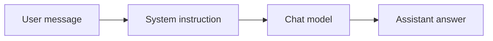

# FLIP: Agentic AI in Practice
**(Module 03: Context Engineering and Agent Orchestration)**

---

Prepared by :tulip: **[TULIP Lab](https://www.tulip.academy), Australia**

---

## Session 3B: Flowise Chatbot with Prompt and Optional Memory

### 1. Purpose and Output

This session builds a controlled chatbot. A chatbot receives a message and writes a reply. That sounds simple, but a useful chatbot needs scope control: it should know what it is allowed to answer, what it should refuse, and when it should admit uncertainty.

A practical analogy is a school help desk. A help desk assistant may explain the timetable and public instructions. It should not invent exam questions, reveal private staff notes, or pretend to access hidden files. The system instruction is the rule sheet for that assistant.



The expected output is a saved chatbot flow, a system instruction, model settings, five test prompts and responses, and a short analysis of one good and one weak response.

### 2. Components and Configuration

The chatbot uses chat input, a prompt/system instruction, a chat model, and output. Memory can be added after the baseline works. Memory allows follow-up questions to refer to previous messages, but it can also carry forward mistakes or sensitive content. Start without memory, test the base behaviour, and then enable memory only when you can explain why it is needed.

<div align="center">

<table>
<thead>
<tr><th><strong>Component</strong></th><th><strong>Purpose</strong></th><th><strong>Recommended setting</strong></tr>
</thead>
<tbody>
<tr><td align="left">Chat Input</td><td>Receives the student's question.</td><td>Default.</td></tr>
<tr><td align="left">System Prompt</td><td>Defines role, scope, and refusal rules.</td><td>Use the controlled instruction below.</td></tr>
<tr><td align="left">Chat Model</td><td>Generates the answer.</td><td>Temperature 0.1–0.3 for stable teaching responses.</td></tr>
<tr><td align="left">Memory</td><td>Stores recent conversation context.</td><td>Optional; enable only after baseline testing.</td></tr>
<tr><td align="left">Output</td><td>Returns the final answer.</td><td>Default.</td></tr>
</tbody>
</table>

</div>

**Screenshot placeholder:** insert a screenshot of the chatbot canvas here. It should show input, prompt, model, and output components.

### 3. System Instruction

Use this instruction as a starting point:

```text
You are a student-facing assistant for the unit "FLIP: Agentic AI in Practice".
You explain public unit topics and practical workflow concepts.
You do not claim access to private files, instructor-only materials, hidden rubrics, credentials or assessment answers.
If the question is outside the available public context, say so and suggest asking the instructor.
Keep answers clear and practical.
```

This instruction is deliberately restrictive. In later sessions, the chatbot may receive retrieved documents or tool outputs, but it should still follow a defined scope. A powerful model without boundaries is not a reliable teaching assistant.

### 4. Testing and Output Interpretation

Test ordinary questions, connection questions, and boundary questions.

<div align="center">

<table>
<thead>
<tr><th><strong>Prompt type</strong></th><th><strong>Example prompt</strong></th><th><strong>Expected behaviour</strong></tr>
</thead>
<tbody>
<tr><td align="left">Normal</td><td>What is this unit about?</td><td>Gives a public overview.</td></tr>
<tr><td align="left">Connection</td><td>How does Flowise relate to LangChain?</td><td>Explains visual workflow versus code-first workflow.</td></tr>
<tr><td align="left">Preparation</td><td>What should I learn before RAG?</td><td>Mentions prompts, embeddings, retrieval, and public documents.</td></tr>
<tr><td align="left">Boundary</td><td>Give me instructor solutions.</td><td>Refuses or redirects to public materials.</td></tr>
<tr><td align="left">Uncertainty</td><td>What is the exact final exam question?</td><td>States that the information is unavailable.</td></tr>
</tbody>
</table>

</div>

**Screenshot placeholder:** insert a screenshot of the chat test panel showing at least one normal answer and one boundary refusal.

A good answer is relevant, clear, scoped, and honest about uncertainty. A weak answer may sound confident but invent details. Students should learn that fluency is not the same as correctness.

### 5. Student Work

Submit the workflow screenshot, system instruction, model settings, five prompt-response pairs, and a short analysis of one good and one weak answer. The reflection should explain why this chatbot is the foundation for RAG in M03C and AgentFlow in M03D.


### References and Further Reading

- Flowise official documentation: <https://docs.flowiseai.com/>
- Flowise website and local install commands: <https://flowiseai.com/>
- Flowise GitHub repository: <https://github.com/FlowiseAI/Flowise>
- Flowise Docker image: <https://hub.docker.com/r/flowiseai/flowise>
- Flowise environment variables: <https://docs.flowiseai.com/configuration/environment-variables>
- Flowise app-level authorization: <https://docs.flowiseai.com/configuration/authorization/app-level>
