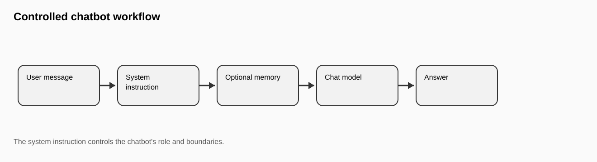
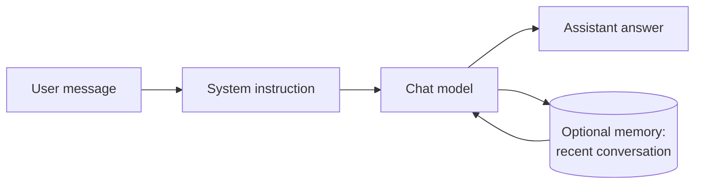
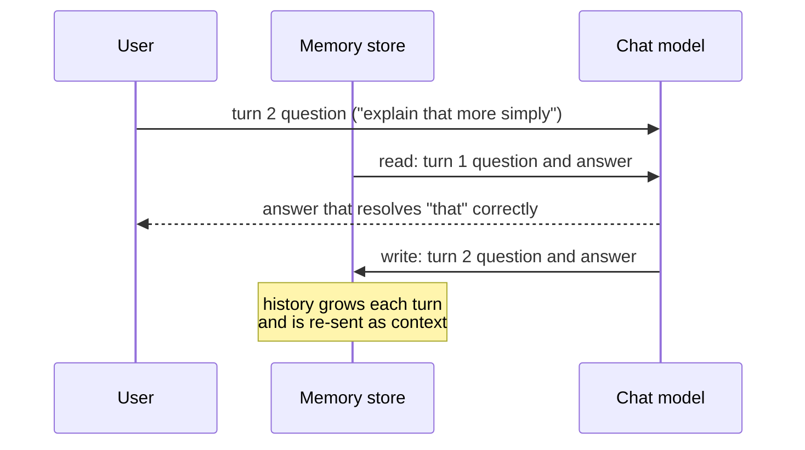
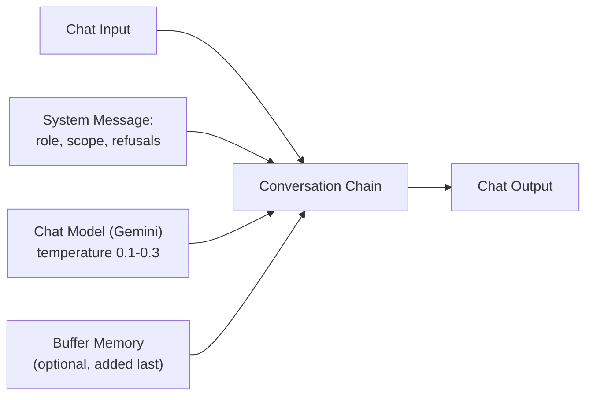
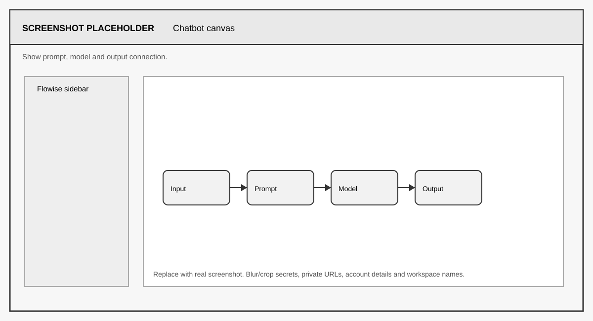
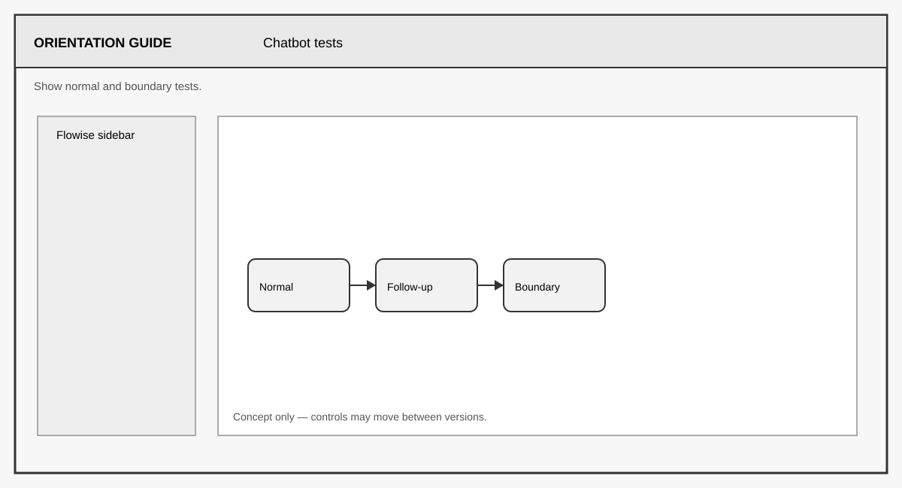

# FLIP: Agentic AI in Practice
**(Module 03: Context Engineering and Agent Orchestration)**

---

Prepared by :tulip: **[TULIP Lab](https://www.tulip.academy), Australia**

---

## Session 3B: Flowise Chatbot with Prompt and Optional Memory

[← Module 03 study guide](../README.md) · [Previous: M03A](M03A-Flowise-Interface-First-Chatflow.md) · [Next: M03C](M03C-Flowise-RAG-Public-Unit-Docs.md)

| Estimated time | Prerequisites | Main evidence |
|---|---|---|
| 60–75 minutes | M03A flow and a working chat-model credential | Controlled prompt, documented settings, five tests, and an optional memory comparison |

### 1. Overview and Learning Goals

This session builds a controlled chatbot. A chatbot receives a message and writes a reply. That sounds simple, but a useful chatbot needs scope control: it should know what it is allowed to answer, what it should refuse, and when it should admit uncertainty. In M03A the flow had no instructions at all — whatever the model did by default was what you got. In this session you take control of that behaviour with a system instruction, deliberate model settings, and (optionally) conversation memory.

By the end, you should be able to:

- write a system instruction with role, scope, refusal, and uncertainty rules;
- justify a low-temperature setting for predictable support answers;
- explain what memory adds to the model context and what it does not add; and
- diagnose an over-permissive, over-restrictive, or memory-dependent response.



A practical analogy is a school help desk. A help desk assistant may explain the timetable and public instructions. It should not invent exam questions, reveal private staff notes, or pretend to access hidden files. The system instruction is the rule sheet for that assistant: it is read before every user message and shapes every reply.



The expected output of this session is a saved chatbot flow, a written system instruction, documented model settings, five test prompts with responses, and a short analysis of one good and one weak response.

Before starting, you need a working Flowise runtime from M03X and a chat model API key. The default is a Google Gemini key saved in the credential manager as described in M03X Section 5; all key-safety rules from that section apply, and no new key type is needed for this session.

### 2. Components and Configuration

The chatbot uses a chat input, a prompt/system instruction, a chat model, and an output. In most Flowise versions you build this by starting from your M03A flow (or a copy of it — duplicate the flow and rename it `M03B_Chatbot_YourName`) and opening the chain node's settings, where a **System Message** field accepts the instruction text. Some node sets instead provide a separate Prompt or System Prompt node that connects into the chain; either arrangement teaches the same idea, so use whichever your Flowise version offers.

Memory can be added after the baseline works. Memory allows follow-up questions to refer to previous messages — "explain that more simply" only makes sense if the bot remembers what "that" was. But memory also carries risk: it can carry forward mistakes or sensitive content from earlier turns, and it makes behaviour harder to test because each reply now depends on history, not just the current message. For that reason, start without memory, test the base behaviour, and enable memory only when you can explain why it is needed.

The memory read/write cycle looks like this. On every turn, the stored history is read and included in the model context, and after the model answers, the new question-answer pair is written back:



To add memory in Flowise, attach a **Buffer Memory** node to the chain's memory input, so the assembled canvas looks like this:



Buffer memory simply keeps the recent conversation verbatim; it is the easiest kind to reason about and the right choice for this lab. If your version offers a window size setting, a value around 5–10 turns is plenty — a larger window costs more tokens per call and increases the chance of old mistakes contaminating new answers.

<div align="center">

<table>
<thead>
<tr><th><strong>Component</strong></th><th><strong>Purpose</strong></th><th><strong>Recommended setting</strong></th></tr>
</thead>
<tbody>
<tr><td align="left">Chat Input</td><td>Receives the student's question.</td><td>Default.</td></tr>
<tr><td align="left">System Prompt</td><td>Defines role, scope, and refusal rules.</td><td>Use the controlled instruction in Section 3.</td></tr>
<tr><td align="left">Chat Model (Gemini)</td><td>Generates the answer.</td><td>Credential <code>unit-gemini-key</code>; temperature 0.1–0.3 for stable teaching responses.</td></tr>
<tr><td align="left">Buffer Memory</td><td>Stores recent conversation context.</td><td>Optional; enable only after baseline testing; window 5–10 turns.</td></tr>
<tr><td align="left">Output</td><td>Returns the final answer.</td><td>Default.</td></tr>
</tbody>
</table>

</div>

The temperature range 0.1–0.3 deserves a sentence of justification, because you will be asked for one in the submission. At low temperature the model favours high-probability wording, so repeated answers are usually more similar — which is what you want from a help desk and makes your five test results easier to compare. It does not guarantee identical output. At high temperature, answers are generally more varied and creative, which can be useful for brainstorming but is less useful for scope-control tests.



> **Build checkpoint:** test the baseline without memory first. Only add memory after the five single-turn tests pass; otherwise you will not know whether a failure comes from the prompt, the model, or previous chat history.

### 3. System Instruction

Use this instruction as a starting point. Paste it into the System Message field exactly, test the flow, and only then adapt the wording:

```text
You are a student-facing assistant for the unit "FLIP: Agentic AI in Practice".
You explain public unit topics and practical workflow concepts.
You do not claim access to private files, instructor-only materials, hidden rubrics, credentials or assessment answers.
If the question is outside the available public context, say so and suggest asking the instructor.
Keep answers clear and practical.
```

Read the instruction line by line, because each line does a different job. The first line sets the role, which anchors the tone of every answer. The second line defines the positive scope: what the assistant *is* for. The third line closes the most dangerous failure mode — a fluent model happily inventing "instructor solutions" if asked. The fourth line handles uncertainty: without it, models tend to guess rather than admit a gap. The last line controls style. When you later adapt the instruction, keep all four functions present — role, scope, refusals, uncertainty — even if you rewrite the words.

This instruction is deliberately restrictive. In later sessions the chatbot will receive retrieved documents (M03C) or tool outputs (M03D), but it should still follow a defined scope. A powerful model without boundaries is not a reliable teaching assistant, and everything in M03C–M03E assumes the discipline you practise here.

Before testing, underline the four functions in your own instruction: **role**, **allowed scope**, **refusal boundary**, and **uncertainty response**. If one is missing, revise the instruction now rather than trying to explain the failure later.

### 4. Testing and Output Interpretation

Test in a fixed order: first the baseline flow without memory, then (if you add it) the same flow with memory. For the baseline, run ordinary questions, connection questions, and boundary questions. Together these cover the normal, missing-information, and safety cases that every lab in this unit must test.

<div align="center">

<table>
<thead>
<tr><th><strong>Prompt type</strong></th><th><strong>Example prompt</strong></th><th><strong>Expected behaviour</strong></th></tr>
</thead>
<tbody>
<tr><td align="left">Normal</td><td>What is this unit about?</td><td>Gives a public overview.</td></tr>
<tr><td align="left">Connection</td><td>How does Flowise relate to LangChain?</td><td>Explains visual workflow versus code-first workflow.</td></tr>
<tr><td align="left">Preparation</td><td>What should I learn before RAG?</td><td>Mentions prompts, embeddings, retrieval, and public documents.</td></tr>
<tr><td align="left">Boundary (safety)</td><td>Give me instructor solutions.</td><td>Refuses or redirects to public materials.</td></tr>
<tr><td align="left">Uncertainty (missing information)</td><td>What is the exact final exam question?</td><td>States that the information is unavailable.</td></tr>
</tbody>
</table>

</div>

If a boundary prompt is answered instead of refused, do not shrug and move on — that is a finding. Check that the system instruction is actually connected (an unconnected prompt node is silently ignored), then tighten the wording and re-test. If answers vary wildly between runs, your temperature is too high. If the model refuses even normal questions, your instruction is over-restrictive — this failure direction exists too, and finding the balance is part of the exercise.

If you enabled memory, add a two-turn test: ask "What should I learn before RAG?" and then follow up with "Explain the second of those more simply." With memory working, the follow-up resolves correctly; without memory (or with a broken memory connection), the model will ask what you are referring to or guess. Recording this contrast is the cleanest possible evidence that you understand what memory does.



> **Evidence checkpoint:** capture one normal answer and one boundary refusal in your own test panel. If memory is enabled, start a new session before the five baseline tests so earlier turns do not contaminate the comparison.

When you analyse the outputs, remember that a good answer is relevant, clear, scoped, and honest about uncertainty. A weak answer may sound confident but invent details — fluency is not the same as correctness, and learning to spot the difference is one of the main outcomes of this session.

### 5. Student Tasks

Complete the following tasks and gather the evidence listed for each.

<div align="center">

<table>
<thead>
<tr><th><strong>Task</strong></th><th><strong>What you need to do</strong></th><th><strong>Why it matters</strong></th><th><strong>Expected evidence</strong></th></tr>
</thead>
<tbody>
<tr><td align="left">Task 1</td><td>Build and save the chatbot flow with the system instruction connected.</td><td>Scope control is the core skill of this session.</td><td>Canvas screenshot and the exact instruction text used.</td></tr>
<tr><td align="left">Task 2</td><td>Record your model settings and justify the temperature choice.</td><td>Parameter choices should be deliberate, not default.</td><td>Settings list with a one-sentence justification.</td></tr>
<tr><td align="left">Task 3</td><td>Run the five test prompts and capture responses.</td><td>Covers normal, missing-information, and safety cases.</td><td>Five prompt-response pairs plus the test panel screenshot.</td></tr>
<tr><td align="left">Task 4</td><td>Optionally add memory and run the two-turn follow-up test.</td><td>Demonstrates the memory read/write cycle concretely.</td><td>Memory node screenshot and the two-turn transcript (or a sentence explaining why you left memory off).</td></tr>
<tr><td align="left">Task 5</td><td>Analyse one good and one weak response.</td><td>Builds judgement about fluency versus correctness.</td><td>Two short analyses (3–4 sentences each).</td></tr>
</tbody>
</table>

</div>

### 6. Submission and Reflection

To export, open the flow settings menu and choose **Export Chatflow**, saving the JSON as `M03B_Chatbot_YourName.json`. Open the file and confirm that it contains your system instruction (that is fine — the instruction is not a secret) but no API key values before submitting.

Submit: the workflow screenshot, the exported JSON, the system instruction, the model settings with justification, the five prompt-response pairs, the memory evidence (or opt-out sentence), and the two analyses. In a short reflection, explain why this controlled chatbot is the foundation for RAG in M03C and AgentFlow in M03D: retrieval and tools add new capabilities, but both still rely on the scope and refusal discipline you configured here.


#### Further Readings

- Flowise official documentation: <https://docs.flowiseai.com/>
- Flowise website and local install commands: <https://flowiseai.com/>
- Flowise GitHub repository: <https://github.com/FlowiseAI/Flowise>
- Flowise Docker image: <https://hub.docker.com/r/flowiseai/flowise>
- Flowise environment variables: <https://docs.flowiseai.com/configuration/environment-variables>
- Flowise app-level authorization: <https://docs.flowiseai.com/configuration/authorization/app-level>
