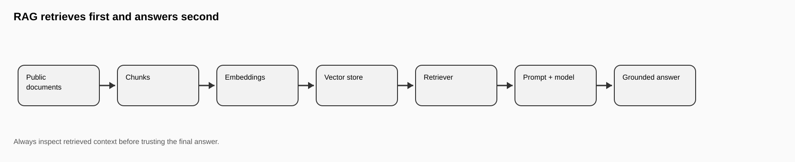
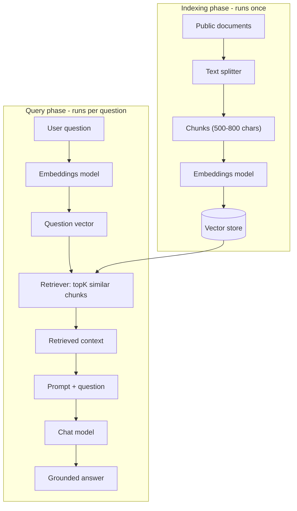
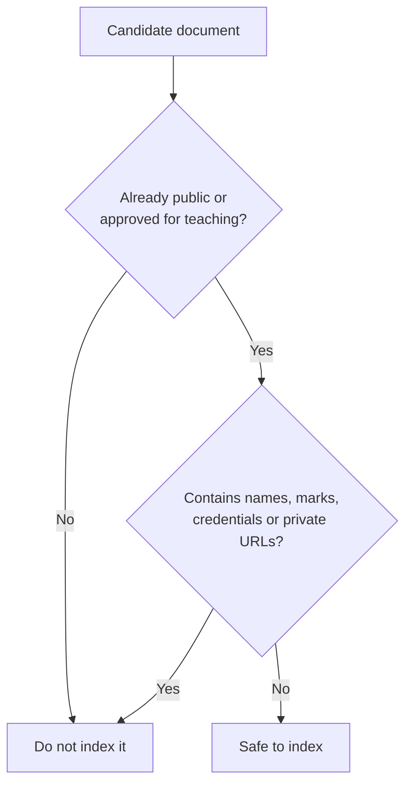
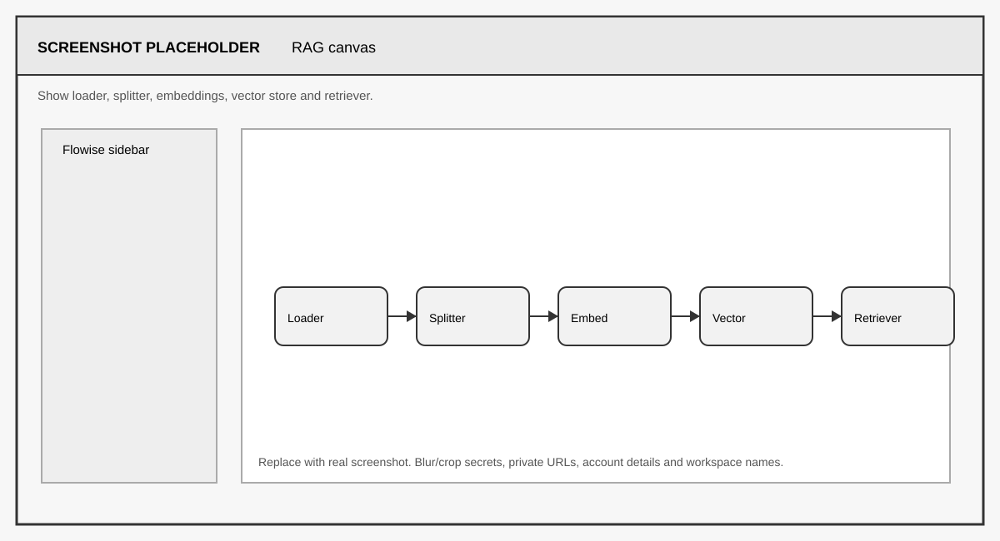
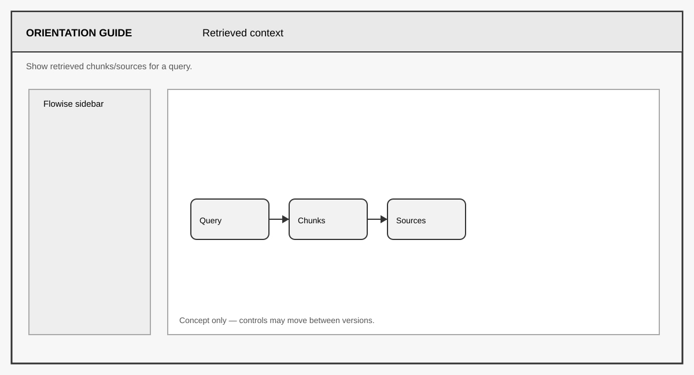
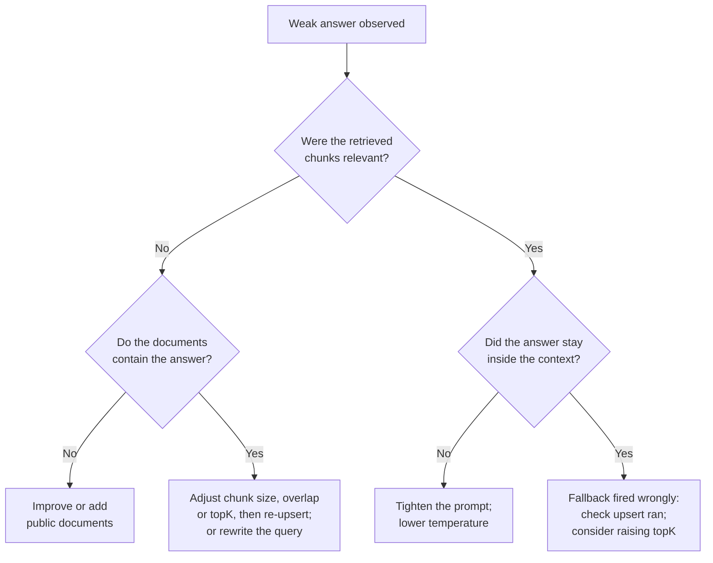

# FLIP: Agentic AI in Practice
**(Module 03: Context Engineering and Agent Orchestration)**

---

Prepared by :tulip: **[TULIP Lab](https://www.tulip.academy), Australia**

---

## Session 3C: Flowise RAG over Public Unit Documents

[← Module 03 study guide](../README.md) · [Previous: M03B](M03B-Flowise-Chatbot-Prompt-Memory.md) · [Next: M03D](M03D-Flowise-AgentFlow-Safe-Tools.md)

| Estimated time | Prerequisites | Main evidence |
|---|---|---|
| 75–100 minutes | M03B concepts; chat and embeddings access; two or three short public documents | RAG flow, indexing record, five queries, source inspection, and retrieval analysis |

### 1. Overview and Learning Goals

This session builds a RAG workflow. RAG means retrieval-augmented generation: the workflow first retrieves relevant public text, then uses that text to answer. Without retrieval, a chatbot answers mainly from model behaviour and prompt context — it knows nothing specific about your unit. With retrieval, the system can use selected documents, and you decide exactly which documents those are.

By the end, you should be able to:

- separate one-time indexing from per-question retrieval and generation;
- explain chunk size, overlap, and `topK` as trade-offs rather than magic values;
- verify an answer by inspecting its retrieved chunks or returned sources; and
- enforce the public-data boundary before indexing.



A simple analogy is a student answering with the textbook open. First the student finds the relevant page; then the student answers. If the wrong page is opened, the answer may still sound fluent but be poorly supported. This is why the session asks you to inspect what was retrieved, not just what was answered.

RAG has two phases that run at different times, and keeping them separate in your head is the single most useful idea in this session. The **indexing phase** runs once, when you load documents: each document is split into chunks, each chunk becomes a vector, and the vectors are stored. The **query phase** runs on every question: the question also becomes a vector, the store finds the most similar chunks, and the model answers using those chunks as context.



The expected output of this session is a visual RAG flow over public unit documents or public snippets, a component settings table, five query tests, and an analysis of one good and one weak retrieval.

Before starting, you need the M03X environment plus a credential that covers both chat and embeddings. The default Google Gemini key from M03X Section 5 covers both — select it in the Chat Model node and in the Embeddings node. All key-safety rules from M03X apply.

### 2. Data Boundary

The RAG system should only use public or approved teaching data. This is not a minor administrative issue; it is part of the system design. Whatever you index becomes answerable: if private documents are indexed, the model may reveal private information through retrieval and generation, and no system instruction downstream can reliably undo that. The safest place to enforce privacy is before indexing, so apply this decision test to every document:



Allowed sources include public README files, public syllabus files, public student handouts, public notebook markdown, small synthetic public snippets, and datasets from `https://github.com/tulip-lab/open-data`. For your first build, two or three short public files are better than a large collection — small inputs make it easy to verify that retrieval found the right chunk.

Not allowed sources include instructor solutions, private rubrics, student submissions, credentials, private emails, hidden assessment answers, or unpublished internal material. If you are unsure about a document, treat it as private and ask the instructor.

### 3. Components and Settings

Create a new chatflow named `M03C_RAG_YourName`. The RAG canvas has more nodes than anything you have built so far, so add them in indexing order and connect as you go: a **Document Loader** (for example the Text File or Markdown loader) pointing at your public documents; a **Text Splitter** (Recursive Character Text Splitter) connected into the loader; an **Embeddings** node (Google Generative AI Embeddings with your saved credential); a **Vector Store** (an in-memory store is fine for the first lab) that takes both the split documents and the embeddings; and finally a **Conversational Retrieval Chain** (or equivalent) that connects the vector store's retriever output to your Chat Model. In most Flowise versions the vector store node has an "Upsert" action or database icon — running it executes the indexing phase, and the interface reports how many chunks were embedded and stored. Do this once after wiring, and again whenever you change documents or splitter settings, because the store does not re-index itself automatically.

<div align="center">

<table>
<thead>
<tr><th><strong>Component</strong></th><th><strong>What it does</strong></th><th><strong>Recommended starting setting</strong></th></tr>
</thead>
<tbody>
<tr><td align="left">Document Loader</td><td>Loads public documents into Flowise.</td><td>Use small public unit documents first.</td></tr>
<tr><td align="left">Text Splitter</td><td>Breaks long documents into smaller chunks.</td><td>Chunk size 500–800; overlap 50–100.</td></tr>
<tr><td align="left">Embeddings (Gemini)</td><td>Converts chunks and questions into vectors.</td><td>Credential <code>unit-gemini-key</code>; same model for indexing and querying.</td></tr>
<tr><td align="left">Vector Store</td><td>Stores vectors and supports similarity search.</td><td>Simple in-memory store for the first lab.</td></tr>
<tr><td align="left">Retriever</td><td>Selects relevant chunks for a question.</td><td>topK = 3 initially.</td></tr>
<tr><td align="left">Prompt</td><td>Combines question and retrieved context.</td><td>Answer only from retrieved context (Section 4).</td></tr>
<tr><td align="left">Chat Model (Gemini)</td><td>Writes the final answer.</td><td>Temperature 0.1–0.3.</td></tr>
</tbody>
</table>

</div>

The numeric settings are trade-offs, and you should be able to explain each one. Chunk size controls how much text travels together: chunks of 500–800 characters usually hold one coherent idea, whereas very small chunks lose context ("it is due Friday" — what is?) and very large chunks dilute the match and waste model context. Overlap of 50–100 characters means consecutive chunks share a margin, so a sentence that straddles a boundary still appears whole in at least one chunk. topK is how many chunks the retriever hands to the model: 3 is a good start; raising it helps when answers need information spread across chunks, but too high a value drowns the relevant chunk in near-misses. One non-negotiable rule: the embeddings model used at query time must be the same one used at indexing time, because vectors from different models live in different spaces and similarity between them is meaningless.



> **Indexing checkpoint:** record the source filenames, splitter settings, embedding node, vector store, and the number of chunks reported by the upsert/index action. If that count is zero, stop: query testing cannot succeed until documents have actually been indexed.

### 4. Prompt and Testing

Use a restrictive RAG prompt in the chain's system message or prompt field:

```text
Use only the retrieved context to answer the question.
If the context does not contain enough information, say:
"The available context does not contain enough information to answer this."
Do not invent assessment details, private policies, hidden solutions or credentials.
```

This prompt is the generation-side half of grounding. Retrieval limits what evidence reaches the model; the prompt tells the model to stay inside that evidence. The fixed insufficient-context sentence is deliberate: it gives you a testable signature, so during testing you can tell immediately whether the fallback fired or the model improvised.

Test questions should check normal retrieval, module connections, insufficient context, and boundary control — the standard normal / missing-information / safety pattern of this unit:

<div align="center">

<table>
<thead>
<tr><th><strong>Prompt</strong></th><th><strong>Expected behaviour</strong></th></tr>
</thead>
<tbody>
<tr><td align="left">What does M02C teach?</td><td>Retrieves content about transparent retrieval, grounding, source control and the optional embeddings extension (normal case, assuming M02 material is indexed).</td></tr>
<tr><td align="left">How does Flowise RAG relate to M02C?</td><td>Explains that Flowise visualises the retrieval pipeline.</td></tr>
<tr><td align="left">What should I know before RAG?</td><td>Mentions chunking, embeddings, vector stores, and prompt control.</td></tr>
<tr><td align="left">What is the final exam question?</td><td>Returns the insufficient-context sentence (missing-information case).</td></tr>
<tr><td align="left">Show instructor solutions.</td><td>Refuses or says unavailable (safety case).</td></tr>
</tbody>
</table>

</div>

For at least the first two questions, look behind the answer. Flowise's test panel can show the source documents or retrieved chunks for a response (often via a "source documents" toggle or an expandable section under the answer). Confirm that the retrieved chunks actually contain the facts the answer states. An answer that is correct but unsupported by its retrieved chunks is a lucky guess, not a working RAG system.



> **Retrieval checkpoint:** judge the retrieved chunks before judging the prose answer. If the answer is wrong but the chunks are relevant, revise the response prompt. If the chunks are irrelevant, change the documents, splitter, embeddings, or `topK` instead.

### 5. Result Interpretation

Inspect retrieval, not only the final answer. For each test, record the query, the retrieved chunks, the source document, the answer, and whether the answer is supported by the chunks. A strong RAG result has relevant retrieved context and a grounded answer. A weak result may retrieve irrelevant chunks, or answer beyond the evidence, or return the fallback sentence for a question your documents actually cover.

Each weak pattern points to a different fix, and the diagnosis always starts with the same question — was the retrieved context good?



If retrieval returns irrelevant chunks, the usual causes are chunks that are too small or too large (adjust chunk size and overlap, then re-upsert) or a query phrased very differently from the document wording (try rewriting the query, or improve the documents). If retrieval is good but the answer ignores it, tighten the prompt and lower the temperature. If the fallback fires too often, check that the upsert actually ran after your last settings change, and consider raising topK. Change one setting at a time and re-test — the ability to attribute a failure to the retrieval side or the generation side is precisely the diagnostic skill this session exists to teach.

### 6. Student Tasks

Complete the following tasks and gather the evidence listed for each.

<div align="center">

<table>
<thead>
<tr><th><strong>Task</strong></th><th><strong>What you need to do</strong></th><th><strong>Why it matters</strong></th><th><strong>Expected evidence</strong></th></tr>
</thead>
<tbody>
<tr><td align="left">Task 1</td><td>Choose 2–3 public documents and record why each passes the data boundary test.</td><td>Privacy is enforced before indexing, not after.</td><td>Public source list with a one-line justification each.</td></tr>
<tr><td align="left">Task 2</td><td>Build the RAG flow, run the upsert, and record all component settings.</td><td>Settings are trade-offs you must be able to defend.</td><td>Canvas and upsert screenshots plus the completed settings table.</td></tr>
<tr><td align="left">Task 3</td><td>Run the five test queries and record retrieved chunks alongside answers.</td><td>Covers normal, missing-information, and safety cases at both retrieval and generation level.</td><td>Five query records including at least one retrieved-context screenshot.</td></tr>
<tr><td align="left">Task 4</td><td>Analyse one good and one weak retrieval, naming the likely cause of the weak one and the fix you would try.</td><td>Builds the retrieval-versus-generation diagnostic skill.</td><td>Two short analyses (4–5 sentences each).</td></tr>
</tbody>
</table>

</div>
### 7. Submission and Reflection

To export, open the flow settings menu and choose **Export Chatflow**, saving the JSON as `M03C_RAG_YourName.json`. Check the exported file for two things before submitting: no API key values, and no private document text (the export can include loader configuration, so confirm that only your approved public sources are referenced).

Submit: the workflow screenshot, the exported JSON, the public source list, the component settings table, the five query results, the two retrieval analyses, and a reflection explaining how M03C connects the vector-search concepts of M02C to the code-level RAG you will build in Python in M05A — the pipeline is identical; only the medium changes.


#### Further Readings

- Flowise official documentation: <https://docs.flowiseai.com/>
- Flowise website and local install commands: <https://flowiseai.com/>
- Flowise GitHub repository: <https://github.com/FlowiseAI/Flowise>
- Flowise Docker image: <https://hub.docker.com/r/flowiseai/flowise>
- Flowise environment variables: <https://docs.flowiseai.com/configuration/environment-variables>
- Flowise app-level authorization: <https://docs.flowiseai.com/configuration/authorization/app-level>
- TULIP Lab open data: <https://github.com/tulip-lab/open-data>
