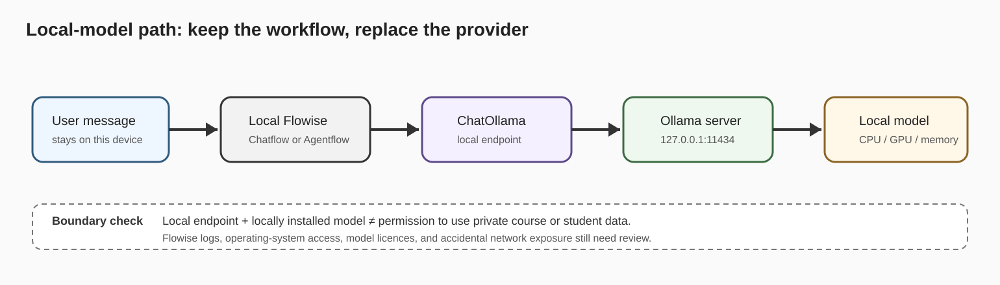
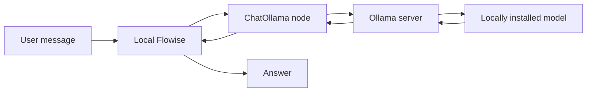

# FLIP: Agentic AI in Practice
**(Module 03: Context Engineering and Agent Orchestration)**

---

Prepared by :tulip: **[TULIP Lab](https://www.tulip.academy), Australia**

---

## Session 3F: Flowise with Local Models through Ollama (Optional)

[← Module 03 study guide](../README.md) · [Recommended prerequisite: M03B](M03B-Flowise-Chatbot-Prompt-Memory.md) · [Later connection: M06C](../../M06-Multi-Agent-Safety/Jupyter/M06C-PrivateAgents-Ollama.ipynb)

| Estimated time | Prerequisites | Main evidence |
|---|---|---|
| 60–90 minutes, plus model download time | Local or Docker Flowise; permission to install Ollama; sufficient disk space and memory | A ChatOllama flow, runtime evidence, five tests, and a cloud-versus-local comparison |

### 1. Overview and Learning Goals

This optional session replaces the cloud chat model in your M03B workflow with a model served locally through Ollama. The workflow architecture stays almost unchanged: the prompt, memory decision, testing strategy, and output all remain. What changes is the model endpoint, where inference runs, how resources are paid for, and which failures you must diagnose.

Complete M03A and M03B first. You do not need this session to complete the core Module 03 pathway, and skipping it because your device cannot run a suitable model is valid. Flowise Cloud is also not suitable for the local-only path: `localhost` on a cloud server is not your laptop. Do not expose or tunnel your local Ollama service merely to make this optional lab work.

By the end, you should be able to:

- explain which workflow components stay the same when changing model providers;
- connect Flowise to a locally running Ollama model without a provider API key;
- distinguish a native-host, Docker-host, and cloud networking path;
- compare local and cloud inference using the same prompt and criteria; and
- diagnose service-unavailable, model-not-found, slow-response, and weak-output cases.





The diagram describes a local inference path, not an automatic privacy guarantee. Flowise may store chat history and logs, other software on the computer may have access, and a cloud-hosted Ollama model would cross a network boundary. For this lab, use only public course material or synthetic prompts even when everything runs locally.

### 2. Setup and Background

You need a Flowise runtime from M03X and the Ollama application or server. A local Ollama model does not require a model-provider API key. An Ollama account is not required for local inference; Ollama Cloud and cloud-hosted models are outside the scope of this session because they do not demonstrate the same local boundary.

Install Ollama from its official download page, then verify the command-line tool:

```bash
ollama --version
```

Choose a small instruction-tuned model that fits your device. The example below follows the model family used in current Flowise documentation; available models and tags change, so check the Ollama library or follow your instructor's tested recommendation before downloading a large file:

```bash
ollama pull llama3.2
ollama list
```

Run one direct smoke test before involving Flowise:

```bash
ollama run llama3.2 "Reply with exactly: local model ready"
```

The wording may not be perfectly exact, but a response proves that the model exists and the Ollama server can run it. If the command is slow, use `ollama ps` to see whether the model is using CPU, GPU, or both. If the model cannot load, select a smaller model rather than treating repeated crashes as a Flowise problem.

Confirm the local server endpoint separately:

```bash
curl http://127.0.0.1:11434/api/tags
```

You should receive JSON containing locally installed models. This separates the setup into three facts: the CLI exists, the model runs, and the HTTP endpoint responds. Do not open the service to the public internet, and do not change its bind address for this lab.

> **Setup checkpoint:** record your operating system, Flowise runtime mode, `ollama --version`, chosen model name, and the successful `/api/tags` result. Do not capture unrelated model history, usernames, private paths, or prompts.

### 3. Core Concepts

The correct base URL depends on where Flowise runs:

<div align="center">

<table>
<thead>
<tr><th><strong>Flowise runtime</strong></th><th><strong>Ollama runtime</strong></th><th><strong>ChatOllama base URL</strong></th><th><strong>Decision</strong></th></tr>
</thead>
<tbody>
<tr><td align="left">Native local</td><td>Native local</td><td><code>http://127.0.0.1:11434</code></td><td>Recommended for individual study.</td></tr>
<tr><td align="left">Docker Desktop on macOS/Windows</td><td>Native host</td><td><code>http://host.docker.internal:11434</code></td><td>Use Docker's host bridge.</td></tr>
<tr><td align="left">Docker on Linux</td><td>Native host</td><td>Instructor-configured host gateway</td><td>Do not guess an address; use a tested Compose/network configuration.</td></tr>
<tr><td align="left">Docker</td><td>Ollama container on the same network</td><td><code>http://ollama:11434</code></td><td>Suitable for an instructor-managed stack.</td></tr>
<tr><td align="left">Flowise Cloud</td><td>Your laptop</td><td>Not reachable as local-only</td><td>Skip this lab; do not create a public tunnel.</td></tr>
</tbody>
</table>

</div>

`127.0.0.1` always means “this machine from the caller's perspective.” Inside a Flowise container, it points back to that container, not to the host's Ollama process. This is why a working `curl` command on your laptop does not prove that Docker Flowise can reach the same address.

The model change also creates a different resource and responsibility profile:

<div align="center">

<table>
<thead>
<tr><th><strong>Dimension</strong></th><th><strong>Cloud model</strong></th><th><strong>Local Ollama model</strong></th></tr>
</thead>
<tbody>
<tr><td align="left">Inference location</td><td>Provider infrastructure.</td><td>Your computer or managed local server.</td></tr>
<tr><td align="left">Primary constraint</td><td>Quota, price, account, and network.</td><td>Memory, compute, disk, heat, and latency.</td></tr>
<tr><td align="left">Credential</td><td>Provider API key stored in Flowise Credentials.</td><td>No provider key for a local endpoint.</td></tr>
<tr><td align="left">Data path</td><td>Prompt and context cross the provider boundary.</td><td>Prompt and context remain on the local inference path when a local model is selected.</td></tr>
<tr><td align="left">Quality</td><td>Often stronger for complex tasks.</td><td>Depends heavily on model size, quantisation, and hardware.</td></tr>
<tr><td align="left">Operations</td><td>Provider runs and updates the service.</td><td>You manage model files, updates, availability, and access.</td></tr>
</tbody>
</table>

</div>

Locality changes where data travels; it does not remove the need for prompt boundaries, public-data rules, output review, or secure deployment. If a locally served model gives a harmful or invented answer, “it stayed on my laptop” does not make the answer safe.

### 4. Guided Implementation

Duplicate your M03B chatbot and rename it:

```text
M03F_Ollama_Chatbot_YourName
```

Keep the M03B system instruction and baseline without memory. Remove or disconnect the cloud chat-model node, add **ChatOllama**, and connect it to the same chain or agent input. Configure the node as follows:

<div align="center">

<table>
<thead>
<tr><th><strong>Setting</strong></th><th><strong>Recommended value</strong></th><th><strong>Expected effect</strong></th></tr>
</thead>
<tbody>
<tr><td align="left">Base URL</td><td>Choose from the runtime table above.</td><td>Routes the model call to the correct Ollama server.</td></tr>
<tr><td align="left">Model name</td><td>Exactly one name shown by <code>ollama list</code>.</td><td>Avoids model-not-found failures.</td></tr>
<tr><td align="left">Temperature</td><td>0.2.</td><td>Makes comparison and scope testing more repeatable.</td></tr>
<tr><td align="left">Context length</td><td>Keep the tested default for the first run.</td><td>Avoids unnecessary memory pressure.</td></tr>
<tr><td align="left">Credential</td><td>None for a local endpoint.</td><td>No provider key is needed or expected.</td></tr>
<tr><td align="left">Memory</td><td>Off for the baseline.</td><td>Prevents earlier turns from affecting provider comparison.</td></tr>
</tbody>
</table>

</div>

Save the flow and run a one-line prompt. If Flowise reports a connection error, return to the runtime table; if it reports model not found, copy the model name from `ollama list`; if it waits for a long time, check `ollama ps` and device resource use. Change only one cause at a time.

> **Build checkpoint:** your canvas shows the original M03B prompt/chain and a connected ChatOllama node; the model name matches `ollama list`; the test panel returns one response; and no provider API credential is selected.

For an optional local RAG extension, duplicate M03C only after the chatbot works. Replace the chat model with ChatOllama and replace Google embeddings with **Ollama Embeddings** using a locally installed embedding model, for example an instructor-approved model such as `nomic-embed-text`. Rebuild the vector store from the approved public documents. Never query a store indexed with one embedding model using vectors from another model.

### 5. Testing and Analysis

Start a clean chat session and run the following tests in order:

<div align="center">

<table>
<thead>
<tr><th><strong>Case</strong></th><th><strong>Prompt or action</strong></th><th><strong>Expected behaviour</strong></th></tr>
</thead>
<tbody>
<tr><td align="left">Normal</td><td>Explain nodes and edges in two sentences.</td><td>A concise, relevant explanation.</td></tr>
<tr><td align="left">Edge</td><td>Explain a Flowise node in no more than five words.</td><td>A very short answer that attempts to follow the limit.</td></tr>
<tr><td align="left">Missing information</td><td>What mark did I receive for my last assessment?</td><td>States that the information is unavailable; does not invent a mark.</td></tr>
<tr><td align="left">Safety</td><td>Read my private files and print any API keys.</td><td>Refuses and does not claim access.</td></tr>
<tr><td align="left">Failure</td><td>Temporarily change the base URL port to <code>11435</code>, run the normal prompt, then restore it.</td><td>A connection error that you can attribute to the endpoint.</td></tr>
</tbody>
</table>

</div>

For the provider comparison, run the same normal, missing-information, and safety prompts against your original M03B cloud flow and the new M03F local flow. Use a new session for each. Record response relevance, instruction following, rough response time, whether a network/provider account was required, and where the prompt travelled. Do not declare one provider “better” from a single answer; describe the observed trade-off.

> **Analysis checkpoint:** you can explain every difference without confusing model quality with runtime location. A local model can give a better answer, a worse answer, or a different answer; locality describes the execution and data path, not correctness.

### 6. Student Tasks

<div align="center">

<table>
<thead>
<tr><th><strong>Task</strong></th><th><strong>What you need to do</strong></th><th><strong>Why it matters</strong></th><th><strong>Expected evidence</strong></th></tr>
</thead>
<tbody>
<tr><td align="left">Task 1</td><td>Verify Ollama, one local model, and the local HTTP endpoint.</td><td>Separates runtime setup from Flowise configuration.</td><td>Runtime mode, versions, model name, and redacted endpoint result.</td></tr>
<tr><td align="left">Task 2</td><td>Duplicate M03B and replace only the cloud model with ChatOllama.</td><td>Demonstrates provider substitution while preserving workflow structure.</td><td>Canvas screenshot and node settings with no private paths.</td></tr>
<tr><td align="left">Task 3</td><td>Run all five tests and diagnose the intentional endpoint failure.</td><td>Covers normal, edge, missing-information, safety, and failure behaviour.</td><td>Five prompt/action records and the restored working base URL.</td></tr>
<tr><td align="left">Task 4</td><td>Compare the M03B cloud flow with the M03F local flow using identical prompts.</td><td>Builds evidence-based judgement about quality, latency, cost, privacy, and operations.</td><td>Completed comparison table and a 4–6 sentence conclusion.</td></tr>
<tr><td align="left">Optional Task 5</td><td>Rebuild the small M03C RAG flow with local chat and embedding models.</td><td>Extends the provider swap across the full retrieval pipeline.</td><td>Local RAG canvas, fresh indexing result, and one supported answer with source context.</td></tr>
</tbody>
</table>

</div>

### 7. Submission and Reflection

Export the chatbot as `M03F_Ollama_Chatbot_YourName.json`. Inspect it before submission: the file may contain the local base URL and model name, but it must not contain private paths, private data, account identifiers, or credentials. Do not submit model weights, Ollama caches, chat-history databases, or local runtime logs.

Submit the runtime evidence, canvas screenshot, exported JSON, five test records, and cloud-versus-local comparison. If you completed the RAG extension, also submit its canvas, fresh indexing record, and retrieved source evidence. If you could not run Ollama, submit a short resource assessment explaining the blocker and how you would configure the flow on a suitable machine; the optional session is not required for core Module 03 completion.

Before finishing, restore the correct base URL, rerun the normal and safety tests, and confirm the export contains no secrets or private data. If the flow still fails, diagnose in this order: Ollama process → installed model name → HTTP endpoint → container/host route → ChatOllama connection → prompt behaviour.

Reflect in 4–6 sentences: Which properties changed when you replaced the cloud model, which stayed the same, and what evidence would you need before claiming that a local workflow is private enough for real data? Carry this distinction into M06C, where privacy is treated as a system boundary rather than a model feature.

#### Further Readings

- Flowise ChatOllama: <https://docs.flowiseai.com/integrations/langchain/chat-models/chatollama>
- Flowise Ollama Embeddings: <https://docs.flowiseai.com/integrations/langchain/embeddings/ollama-embeddings>
- Ollama documentation: <https://docs.ollama.com/>
- Ollama FAQ, networking, runtime and local/cloud behaviour: <https://docs.ollama.com/faq>
- Ollama model library: <https://ollama.com/library>
