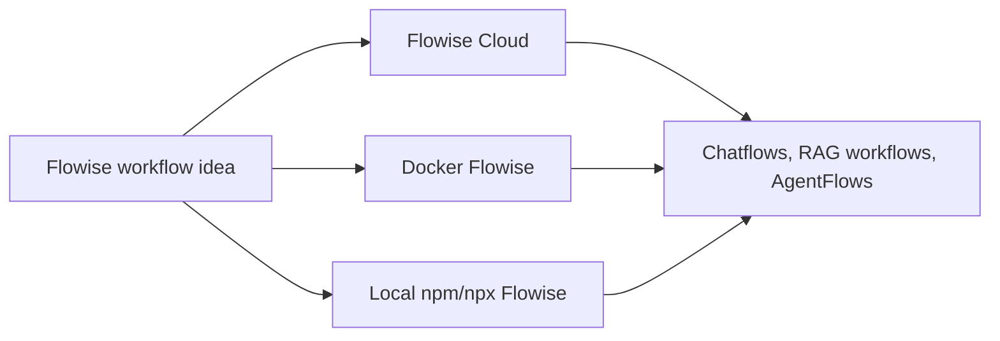
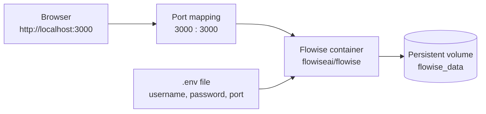
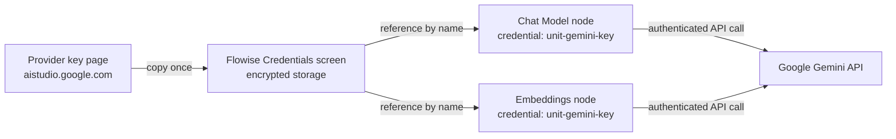
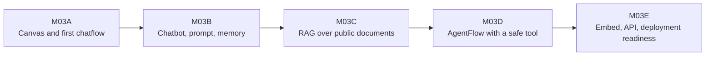

# FLIP: Agentic AI in Practice
**(Module 03: Context Engineering and Agent Orchestration)**

---

Prepared by :tulip: **[TULIP Lab](https://www.tulip.academy), Australia**

---

## Session 3X: Flowise Environment, Docker Setup, API Keys and Credentials

### 1. Purpose

M03X is a prerequisite session. Complete it before M03A. The goal is to make the Flowise environment understandable before you begin building workflows. By the end of this session you should know what Flowise Cloud is, what Docker Flowise is, what local npm/npx Flowise is, which one you are using, which API keys you need for each Module 03 session, and where credentials should be stored so that no secret ever appears in your work.

Flowise can be understood as a visual workshop for AI applications. Instead of writing the whole application in code, you connect visible blocks on a canvas. A block may represent a prompt, a chat model, an embedding model, a vector store, a retriever, a memory component, or a tool. The arrows between blocks show how information moves. This visual view matters for learning: when you later write the same logic in LangChain or LangGraph, you will already have a mental picture of what each component does and how data flows between them.



The key point is that the learning concepts remain the same across the three modes. A chatflow built in Flowise Cloud looks and behaves the same as one built in Docker Flowise. What differs is hosting, persistence, authentication, credentials, access control, and deployment responsibility. Your instructor will tell you which mode the class is using; if you are working independently, Flowise Cloud is the fastest way to start.

### 2. Flowise Cloud, Docker Flowise and Local Flowise

Flowise Cloud is the managed online version. You open `https://cloud.flowiseai.com/chatflows` in a browser, sign in, and build workflows without installing anything. This is the fastest path for classroom use because you do not need Docker or Node.js, and everyone in the class sees the same interface version. It is appropriate when the learning focus is visual workflow design, not infrastructure. The caution is that uploaded data, saved workflows, and credentials are handled inside a cloud workspace that you do not control. You must not upload private files, instructor-only materials, real student submissions, or paste secret API keys anywhere except the credential manager. Free-tier accounts also have usage quotas, so expect occasional rate limits during busy lab sessions.

Docker Flowise runs Flowise inside a container on your own machine, a lab machine, or a cloud VM. This is better when the class needs a reproducible environment or wants to discuss deployment and persistence honestly. Docker makes the runtime explicit: you can see the container, the port mapping, the environment variables, the logs, and the persistent volume where your workflows and credentials live. It is slightly more technical, but it is also more operationally realistic — this is roughly how Flowise would be hosted in a real project.

Local npm/npx Flowise runs directly through Node.js on your machine. It is useful if you already have Node.js installed and want a quick local experiment without Docker. It is less ideal for a large class because different students may have different Node.js versions and package states, which produces inconsistent behaviour that is hard to debug in a lab session.

<div align="center">

<table>
<thead>
<tr><th><strong>Mode</strong></th><th><strong>Typical address</strong></th><th><strong>Best use</strong></th><th><strong>Main caution</strong></th></tr>
</thead>
<tbody>
<tr><td align="left">Flowise Cloud</td><td><code>https://cloud.flowiseai.com/chatflows</code></td><td>Fast classroom start; no local setup.</td><td>Cloud workspace, uploaded data, quota and credentials need care.</td></tr>
<tr><td align="left">Docker Flowise</td><td><code>http://localhost:3000</code></td><td>Reproducible lab setup and deployment discussion.</td><td>Requires Docker, port, volume and password management.</td></tr>
<tr><td align="left">Local npm/npx Flowise</td><td><code>http://localhost:3000</code></td><td>Quick individual experimentation.</td><td>Depends on local Node.js and package environment.</td></tr>
</tbody>
</table>

</div>

Whichever mode you use, confirm that you can reach the Chatflows dashboard before moving on. The dashboard is the home page of Flowise: it lists your saved workflows and provides the button that creates a new one. If the dashboard does not load, nothing else in Module 03 will work, so resolve this first.

> **Screenshot placeholder**
>
> Insert a screenshot of the Flowise Cloud Chatflows dashboard here. It should show the Chatflows list and the "Add New" (or equivalent) button. Blur account name, workspace name, private URLs, and any usage or billing details.
>
> Expected file:
>
> ```text
> ../../Assets/screenshots/flowise/M03X-01-cloud-dashboard.png
> ```

> **Screenshot placeholder**
>
> Insert a screenshot of Docker or local Flowise opened at `http://localhost:3000`. It should demonstrate that the interface is conceptually similar to Flowise Cloud.
>
> Expected file:
>
> ```text
> ../../Assets/screenshots/flowise/M03X-02-local-dashboard.png
> ```

### 3. Docker Setup

This section is required only if your class uses Docker Flowise. The idea behind the setup is simple: Docker downloads a ready-made Flowise image, runs it as an isolated container, exposes it on a port your browser can reach, and stores its data on a persistent volume so that your work survives restarts.



First install Docker Desktop on macOS or Windows, or Docker Engine on Linux. Then confirm that Docker is ready by checking both the engine and the compose plugin:

```bash
docker --version
docker compose version
```

Both commands should print a version number. If either command is not found, Docker is not installed correctly, and you should fix that before continuing.

Create a folder for the lab so all configuration lives in one place:

```bash
mkdir flowise-lab
cd flowise-lab
```

Create a `.env` file. Current Flowise releases use an email-and-password administrator account created through the browser; the older `FLOWISE_USERNAME` and `FLOWISE_PASSWORD` variables are deprecated. The values below protect the local login session and must be long, random and different from one another. Generate them with a password manager or `openssl rand -hex 32`, then keep the file private:

```bash
cat > .env <<'EOF'
PORT=3000
JWT_AUTH_TOKEN_SECRET=replace_with_random_value_1
JWT_REFRESH_TOKEN_SECRET=replace_with_random_value_2
EXPRESS_SESSION_SECRET=replace_with_random_value_3
TOKEN_HASH_SECRET=replace_with_random_value_4
EOF
```

Replace all four placeholder values before starting Flowise. Do not commit `.env` to GitHub: it contains security secrets, and `.env` should always be listed in `.gitignore`.

Create `docker-compose.yml`:

```yaml
services:
  flowise:
    image: flowiseai/flowise:latest
    container_name: flowise
    restart: unless-stopped
    ports:
      - "${PORT}:3000"
    environment:
      - PORT=3000
      - JWT_AUTH_TOKEN_SECRET=${JWT_AUTH_TOKEN_SECRET}
      - JWT_REFRESH_TOKEN_SECRET=${JWT_REFRESH_TOKEN_SECRET}
      - EXPRESS_SESSION_SECRET=${EXPRESS_SESSION_SECRET}
      - TOKEN_HASH_SECRET=${TOKEN_HASH_SECRET}
      - DATABASE_PATH=/root/.flowise
      - APIKEY_PATH=/root/.flowise
      - SECRETKEY_PATH=/root/.flowise
      - LOG_PATH=/root/.flowise/logs
      - BLOB_STORAGE_PATH=/root/.flowise/storage
    volumes:
      - flowise_data:/root/.flowise
    command: flowise start

volumes:
  flowise_data:
```

Three settings in this file deserve attention. The `ports` line maps port 3000 inside the container to the port named in `.env`; if another program already uses port 3000, change `PORT` to something like `3001` and open that port in the browser instead. The authentication variables replace Flowise's unsafe default session secrets. The `volumes` line is the persistence guarantee: everything Flowise saves — workflows, credentials, chat history and the administrator account — is written to the named volume `flowise_data`. Without a persistent volume, this state disappears when the container is removed, which is a frustrating way to lose a lab session's work.

Start Flowise in the background:

```bash
docker compose up -d
```

The first start downloads the image, which may take a few minutes. Then open:

```text
http://localhost:3000
```

On a fresh persistent volume, follow the browser prompt to create the first administrator account with an email address and a strong password. On later starts, sign in with that account. If your Flowise version shows a different first-run screen, follow its administrator setup prompt rather than adding the deprecated username/password variables. If the page does not load, check the logs — the most common causes are a port conflict or a container that is still starting:

```bash
docker logs -f flowise
```

Stop the service when you are finished (your data stays on the volume):

```bash
docker compose stop
```

For a school or university lab, the instructor should test this Docker setup before class, because image download time, first-account setup and port conflicts are much easier to resolve outside a live session. The example uses the `latest` image for independent study; a teaching offering should replace it with the exact Flowise version tested for that class so the interface does not change between the rehearsal and the demonstration.

### 4. Local npm/npx Setup

Local npm/npx setup is shorter but depends on Node.js. Check that you have a recent Node.js LTS version installed (`node --version`), then install and start Flowise:

```bash
npm install -g flowise
npx flowise start
```

Open:

```text
http://localhost:3000
```

The terminal window that runs `npx flowise start` must stay open while you work; closing it stops Flowise. Data is stored in a `.flowise` folder in your home directory, so saved workflows persist between restarts. This mode is acceptable for individual experiments. For teaching at scale, Flowise Cloud or Docker is usually easier to support, because everyone runs exactly the same version.

### 5. API Keys and Credentials

An API key is a secret token that allows Flowise to call an external AI service, and the service bills or rate-limits your account based on it. Treat it like a password. It must never appear in Markdown files, screenshots, GitHub commits, prompt text, exported workflow JSON, or chat messages. If a key is ever exposed, revoke it on the provider's key page and create a new one — do not keep using a leaked key.

Module 03 uses two kinds of model capability. Chat generation writes an answer to a message. Embeddings convert text into vectors so that similar text can be found by similarity search; you will need embeddings only for the RAG session. The table below shows exactly which keys each session needs, so you can prepare them in advance instead of interrupting a build.

<div align="center">

<table>
<thead>
<tr><th><strong>Session</strong></th><th><strong>Likely requirement</strong></th><th><strong>Reason</strong></th></tr>
</thead>
<tbody>
<tr><td align="left">M03A</td><td>No key required for interface practice.</td><td>You can inspect the canvas without running a model.</td></tr>
<tr><td align="left">M03B</td><td>Chat model API key.</td><td>The chatbot must call a model to answer.</td></tr>
<tr><td align="left">M03C</td><td>Chat model API key and embedding capability.</td><td>RAG needs generated answers and vector representations.</td></tr>
<tr><td align="left">M03D</td><td>Chat model API key.</td><td>The agent needs a model to decide whether a tool should be used.</td></tr>
<tr><td align="left">M03E</td><td>No new key by default.</td><td>The focus is reviewing access, embed and API exposure.</td></tr>
</tbody>
</table>

</div>

The default provider for this unit is the **Google Gemini API**, because a single Gemini key covers both chat generation and embeddings, and a free tier is available for study use. To create a Gemini key, follow these steps:

1. Sign in with a Google account and open `https://aistudio.google.com/app/apikey`.
2. Click **Create API key** and choose or create a Google Cloud project when prompted.
3. Copy the generated key immediately and store it somewhere private, such as a local password manager. Do not paste it into a document, an email, or a chat.
4. If you ever suspect the key has been exposed, return to this page, delete the key, and create a new one.

If your class needs live web search in a later session, **SerpAPI** (`https://serpapi.com/`) is the approved search service; do not create that key until a session actually requires it. Other providers appear below only for reference, in case your instructor explicitly approves an alternative — do not create accounts you do not need.

<div align="center">

<table>
<thead>
<tr><th><strong>Provider</strong></th><th><strong>Key page</strong></th><th><strong>Typical use</strong></th></tr>
</thead>
<tbody>
<tr><td align="left">Google Gemini (default)</td><td><code>https://aistudio.google.com/app/apikey</code></td><td>Chat and embeddings for all Module 03 sessions.</td></tr>
<tr><td align="left">SerpAPI (search only)</td><td><code>https://serpapi.com/manage-api-key</code></td><td>Web search, only when a session requires it.</td></tr>
<tr><td align="left">Ollama</td><td>Local installation, no cloud API key.</td><td>Local/private model exploration in later sessions.</td></tr>
</tbody>
</table>

</div>

Once you have a key, register it in Flowise's credential manager rather than typing it into a node. The credential manager encrypts and stores the key server-side; workflow nodes then hold only a reference to the credential name, so the secret value never appears on the canvas, in screenshots, or in exported workflow files.



In Flowise, open **Credentials** from the left-hand menu, click **Add Credential**, choose the provider (for example *Google Generative AI*), paste the API key into the credential field, and save it with a clear name such as `unit-gemini-key`. Later, inside a Chat Model or Embeddings node, you select that saved credential from a dropdown instead of pasting the key. If a model call fails with an authentication error, the usual causes are a mistyped key, a key created for the wrong project, or a node that has no credential selected at all.

> **Screenshot placeholder**
>
> Insert a screenshot of the Credentials screen here. It should show where credentials are created and selected, but no key value should be visible.
>
> Expected file:
>
> ```text
> ../../Assets/screenshots/flowise/M03X-03-credentials.png
> ```

To summarise the safety rules for the whole module: keys live only in the credential manager and your private notes; screenshots must never show a key value; exported workflow JSON must be checked for secrets before submission; and `.env` files must never be committed. Every later session assumes you follow these rules and refers back to this section instead of repeating them.

### 6. Component Map for Module 03

The module increases complexity gradually, and each session builds on the previous one. M03A is about reading the canvas. M03B adds a controlled chatbot with a system instruction and optional memory. M03C adds retrieval over public documents. M03D adds action through a safe tool. M03E reviews whether a finished workflow is safe to expose through an embed widget or API.



<div align="center">

<table>
<thead>
<tr><th><strong>Session</strong></th><th><strong>Main components</strong></th><th><strong>Key settings to check</strong></th></tr>
</thead>
<tbody>
<tr><td align="left">M03A</td><td>Chatflows page, canvas, optional chat model.</td><td>Runtime mode, workflow name, credential location.</td></tr>
<tr><td align="left">M03B</td><td>Chat input, prompt/system instruction, chat model, optional memory.</td><td>Model, credential, temperature, memory, system instruction.</td></tr>
<tr><td align="left">M03C</td><td>Document loader, text splitter, embeddings, vector store, retriever, prompt, chat model.</td><td>Document source, chunk size, overlap, topK, embedding model, data boundary.</td></tr>
<tr><td align="left">M03D</td><td>AgentFlow input, instruction, model/router, approved tool, output.</td><td>Allowed tool, schema, validation rules, refusal behaviour.</td></tr>
<tr><td align="left">M03E</td><td>Embed widget, Prediction API, access control, logs/history, usage limits.</td><td>Public/private access, API protection, disclaimer, data and tool safety.</td></tr>
</tbody>
</table>

</div>

### 7. Completion Criteria

Before M03A, you should be able to answer these questions in plain language:

```text
Which Flowise runtime am I using?
How do I open the dashboard?
Do I need a chat model key today?
Do I need an embedding key today?
Where are credentials stored?
What should never appear in screenshots?
```

Write your answers in a short note — one or two sentences each is enough. Some instructors collect this note as evidence of setup completion; even if yours does not, the note is worth keeping because every later session assumes these answers. As a final self-check, confirm three things in practice, not just on paper: your Flowise dashboard opens, your Gemini key is saved in the credential manager under a clear name, and no secret value is visible anywhere on screen. If all three hold, you are ready for M03A.


### References and Further Reading

- Flowise official documentation: <https://docs.flowiseai.com/>
- Flowise website and local install commands: <https://flowiseai.com/>
- Flowise GitHub repository: <https://github.com/FlowiseAI/Flowise>
- Flowise Docker image: <https://hub.docker.com/r/flowiseai/flowise>
- Flowise environment variables: <https://docs.flowiseai.com/configuration/environment-variables>
- Flowise app-level authorization: <https://docs.flowiseai.com/configuration/authorization/app-level>
- Google AI Studio API keys: <https://aistudio.google.com/app/apikey>
