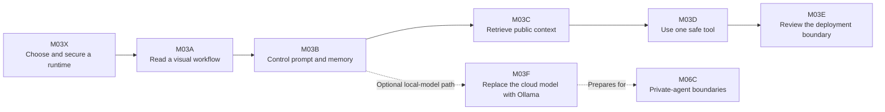

# Module 03: Context Engineering and Agent Orchestration

This is the start page for the Flowise labs in Module 03. The module is designed for independent study: each session states what you need, what to build, how to test it, what evidence to keep, and how to recover when the interface differs from the guide.

## Learning Path

| Session | Focus | Estimated time | Main evidence |
|---|---|---:|---|
| [M03X — Environment Setup](Flowise/M03X-Flowise-Environment-Setup.md) | Runtime, accounts, credentials, and secret safety | 45–75 min | Runtime choice and safe setup check |
| [M03A — Interface and First Chatflow](Flowise/M03A-Flowise-Interface-First-Chatflow.md) | Nodes, edges, settings, and information flow | 45–60 min | Saved flow, tests, and flow explanation |
| [M03B — Prompt and Memory](Flowise/M03B-Flowise-Chatbot-Prompt-Memory.md) | Scope control, uncertainty, and optional memory | 60–75 min | Controlled prompt and comparison tests |
| [M03C — RAG over Public Documents](Flowise/M03C-Flowise-RAG-Public-Unit-Docs.md) | Indexing, retrieval, grounding, and data boundaries | 75–100 min | RAG flow, source checks, and retrieval analysis |
| [M03D — AgentFlow and Safe Tools](Flowise/M03D-Flowise-AgentFlow-Safe-Tools.md) | Tool schema, validation, and refusal behaviour | 75–90 min | AgentFlow, tool trace, and boundary tests |
| [M03E — Deployment Readiness](Flowise/M03E-Flowise-Embed-API-Deployment-Readiness.md) | Embed/API exposure, access, privacy, and cost | 60–75 min | Evidence-backed readiness decision |
| [M03F — Local Models through Ollama](Flowise/M03F-Flowise-Ollama-Local-Models.md) *(optional)* | Local inference, runtime networking, provider comparison, and optional local RAG | 60–90 min plus download time | ChatOllama flow, failure diagnosis, and cloud-versus-local comparison |

## How to Study Each Session

1. Read the session guide and check the prerequisites before opening Flowise.
2. Rebuild the workflow yourself. The diagrams explain the architecture; they are not files to import.
3. Stop at each checkpoint and compare what you see with the stated expected behaviour.
4. Run normal, missing-information, and safety tests. M03C and M03D add retrieval and tool-specific cases.
5. Capture your own evidence with secrets and private workspace details hidden.
6. Export the flow, inspect the JSON for secrets, and complete the reflection before moving on.

## When Your Flowise Screen Looks Different

Flowise evolves, so a button or node may move or be renamed. Preserve the concept before chasing an exact label:

| You need | Search for this concept | Common current form |
|---|---|---|
| A basic chatbot | A chain that accepts a chat model | Conversation Chain or another simple chat chain |
| Model access | A chat model integration | ChatGoogleGenerativeAI or an instructor-approved equivalent |
| Conversation history | A memory input | Buffer Memory or a bounded chat-memory option |
| Retrieval | A chain or Agentflow retriever that accepts a vector-store retriever | Conversational Retrieval QA Chain, Retriever, or an equivalent template |
| Controlled action | An Agentflow agent/tool path | Start → Agent with approved tool → End |
| Local model | A chat model served by Ollama | ChatOllama connected to a reachable local endpoint |

If compatible handles will not connect, do not force them. Remove the last connection, verify that the two nodes belong to the same builder family, and use the in-app template or current official documentation for your installed version.

## Safety Rules for the Whole Module

- Use only public unit material or approved synthetic data.
- Store provider keys in Flowise Credentials; never paste them into a prompt or node text field.
- Keep keys, reachable flow IDs, private URLs, account details, and student data out of screenshots and exports.
- Treat a public embed or API as a real deployment boundary: it can create cost, logs, privacy obligations, and tool risk.
- If a key is exposed, revoke it and create a replacement. Blurring the screenshot does not undo exposure.

Start with [M03X — Flowise Environment Setup](Flowise/M03X-Flowise-Environment-Setup.md).

After M03B, students with suitable local hardware may take the optional [M03F Ollama path](Flowise/M03F-Flowise-Ollama-Local-Models.md). It is an extension, not a prerequisite for M03C–M03E.
