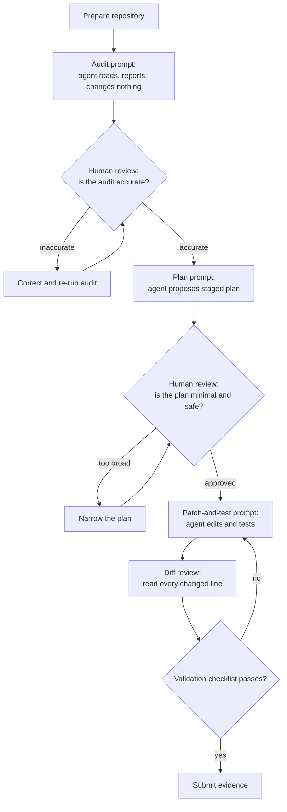
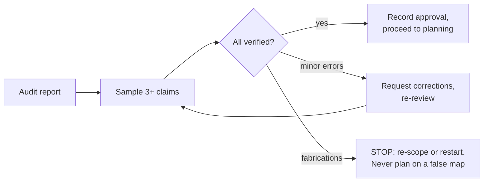
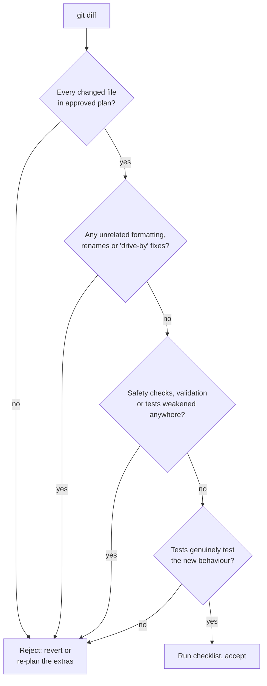

# FLIP: Agentic AI in Practice
**(Module 08: Advanced Agentic AI)**

---

## Session 8B: Codex Codebase Understanding and Development

---

**Table of Contents**

1. [Overview and Learning Goals](#m08b-overview)
2. [Repository Preparation](#m08b-preparation)
3. [The Audit: Understanding Before Changing](#m08b-audit)
4. [Planning, Patching and Testing](#m08b-planning)
5. [Diff Review and Validation](#m08b-review)
6. [Student Tasks](#m08b-tasks)
7. [Submission and Reflection](#m08b-submission)

---

<a id="m08b-overview"></a>

### 1. Overview and Learning Goals

This session teaches you how to use a coding agent — Codex or any comparable Codex-style tool — to understand an unfamiliar codebase, plan a small change, implement it, and verify it, while you stay in control at every step. The skills are provider-neutral: the prompts and review habits in this handout work with any coding agent that can read a repository, propose plans and produce diffs.

The single most important rule of this session is stated up front, because everything else is built around it:

> **The agent must never modify files before you have reviewed its audit and its implementation plan.**

A coding agent is like a new contractor arriving at a building site. A good contractor first walks the site, reads the blueprints, and writes down what they found; then they propose a plan; only after the owner signs off do they pick up tools. A contractor who starts knocking down walls on arrival is dangerous no matter how skilled they are. You are the owner. The review gates in this workflow are your signatures.

The full workflow looks like this. Notice that every action stage is preceded by a human review gate:



By the end of this session you should be able to prepare a repository for safe agent work, write an audit prompt that produces a verifiable report, detect hallucination in an agent's description of code, request and critique a staged implementation plan, supervise a patch-and-test cycle, and review a diff line by line before accepting it.

<a id="m08b-preparation"></a>

### 2. Repository Preparation

Before the agent reads anything, you prepare the ground. Preparation matters for two reasons. First, safety: you must know exactly what the agent can see and touch, so that a mistake is recoverable. Second, quality: an agent working in a clean, well-scoped repository produces far more accurate audits than one wading through build artefacts and uncommitted experiments.

For this session, use one of the following as your practice codebase:

- **This very repository** (`tulip-lab/agentic-ai`), which you already understand well enough to catch agent mistakes — an ideal property for a first supervised run.
- **Any small public GitHub repository** (roughly 10–50 source files) with a licence that permits study, a README, and ideally some tests. Avoid huge frameworks: you cannot review what you cannot read.

Work through the preparation checklist:

<div align="center">

<table>
<thead>
<tr><th><strong>Step</strong></th><th><strong>What to do</strong></th><th><strong>Why it matters</strong></th></tr>
</thead>
<tbody>
<tr><td align="left">Clone fresh</td><td>Clone the repository into a new directory used only for this exercise.</td><td>Keeps the exercise isolated from your other work; a bad outcome is deleted, not untangled.</td></tr>
<tr><td align="left">Create a working branch</td><td>Run <code>git checkout -b agent-exercise</code> before the agent does anything.</td><td>The main branch stays pristine; every agent change is one <code>git diff main</code> away from inspection and one command away from being discarded.</td></tr>
<tr><td align="left">Verify a clean state</td><td>Confirm <code>git status</code> reports nothing to commit.</td><td>If the tree is dirty before the agent starts, you can no longer tell agent changes from your own.</td></tr>
<tr><td align="left">Remove secrets from reach</td><td>Check that no <code>.env</code> files, keys or tokens are present in the working tree.</td><td>Anything the agent can read may end up quoted in its output or its context. Secrets do not belong in an exercise repository at all.</td></tr>
<tr><td align="left">Record the baseline</td><td>Run the existing test suite (or at least import/build the project) and save the output.</td><td>If tests already fail before the agent touches anything, you must know — otherwise you will blame the agent for pre-existing breakage, or worse, miss new breakage hiding among old.</td></tr>
<tr><td align="left">Define the allowed scope</td><td>Write down, in one or two sentences, which files or directories the agent may eventually change.</td><td>Scope written before the work is a contract; scope invented afterwards is an excuse.</td></tr>
</tbody>
</table>

</div>

Expected states after preparation — normal: clean branch, baseline test output saved, scope note written. Edge: the project has no tests, in which case your baseline is "the project imports/builds without error", and you should note the missing tests as a finding. Failure: the repository will not build at all; choose a different practice repository rather than asking the agent to fix a broken world on day one.

<a id="m08b-audit"></a>

### 3. The Audit: Understanding Before Changing

The audit is a read-only pass. You ask the agent to explore the repository and report what it finds, and you explicitly forbid modification. The audit's purpose is twofold: it gives you a map of the codebase, and — just as importantly — it gives you a sample of the agent's reliability on *this* codebase, which you can check before trusting it with edits.

#### 3.1 The audit prompt

Use the following prompt as a starting point. Copy it, replace the bracketed parts, and paste it to your coding agent:

```text
You are auditing a repository. This is a READ-ONLY task: do not create,
modify, delete or rename any file. Do not run any command that changes
state (no installs, no formatters, no git commands that write).

Repository: [path or URL of the practice repository]

Produce an audit report with exactly these sections:

1. Purpose: what this project does, in 3-5 sentences, based only on
   files you actually read. Name the files that support each claim.
2. Structure: the main directories and the role of each, as a short list.
3. Entry points: the files where execution or usage starts (main modules,
   CLI scripts, notebooks, published API), each with a one-line role.
4. Key components: the 5-10 most important files or modules, and for each:
   what it does, what it depends on, and one representative function or
   class name that actually appears in it.
5. Tests and checks: what automated tests or validation exist, how they
   appear to be run, and what they cover.
6. Risks and unknowns: anything you could not determine, anything that
   looks fragile, and any file you did not read but believe is relevant.

Rules:
- Every claim must cite the file it comes from.
- If you are not sure, say "uncertain" rather than guessing.
- Do not propose any changes yet.
```

The design of this prompt is worth understanding, because you will adapt it to other tasks. The read-only rule is stated twice (at the start and in the rules) because instruction-following degrades over long outputs. The fixed section list makes the report checkable — you know what must be present. The citation rule ("name the files") is the single strongest anti-hallucination device available: a claim with a file name attached can be verified in seconds, and an agent that must cite is far less likely to invent. The "uncertain" instruction gives the agent a safe way to express gaps, which is exactly what you gave your own workflows in the M08 notebooks when you added `insufficient_context` outcomes.

#### 3.2 Human review of the audit

Now you check the audit — not skim it, check it. Sample at least three concrete claims and verify each against the actual repository. Open the cited file and confirm the function exists, the dependency is real, the description matches the code.

You are looking for hallucination, and it has recognisable shapes:

<div align="center">

<table>
<thead>
<tr><th><strong>Hallucination pattern</strong></th><th><strong>What it looks like</strong></th><th><strong>How to catch it</strong></th></tr>
</thead>
<tbody>
<tr><td align="left">Phantom files</td><td>The report cites <code>utils/helpers.py</code> or <code>config.yaml</code> — plausible names that do not exist in this repository.</td><td>Check every cited path against <code>git ls-files</code> or the file tree.</td></tr>
<tr><td align="left">Invented symbols</td><td>A "representative function" such as <code>process_data()</code> that appears in no file, or belongs to a different project the model has seen.</td><td>Search the repository for the exact name.</td></tr>
<tr><td align="left">Template knowledge</td><td>Descriptions that would be true of any project of this type ("the tests use pytest fixtures for setup") but are not true of this one.</td><td>Ask: could this sentence have been written without reading the repo? Then verify it.</td></tr>
<tr><td align="left">Overconfident behaviour claims</td><td>Statements about runtime behaviour ("errors are retried three times") stated as fact when no code implements them.</td><td>Ask the agent to quote the exact lines that implement the claim.</td></tr>
<tr><td align="left">Silent gaps</td><td>A major directory or file never mentioned at all — absence is harder to notice than error.</td><td>Compare the report's structure section against the real top-level listing.</td></tr>
</tbody>
</table>

</div>

Decide the outcome explicitly. Normal: the sampled claims check out, and you write one sentence recording that the audit passed review. Edge: minor errors (a misdescribed helper, an unread file) — correct them in a follow-up prompt ("Section 4 claims X; the file actually does Y; please revise") and re-review the revised sections. Failure: fabricated files or functions in your sample. Do not proceed to planning on top of a failed audit; an agent that misreports the code will mis-plan the change. Re-run the audit with a narrower scope (for example, one directory at a time), or restart the session.



<a id="m08b-planning"></a>

### 4. Planning, Patching and Testing

With a verified audit in hand, you choose a small, concrete task and ask the agent to plan it. Good first tasks are genuinely useful but low-risk: fix a specific typo cluster in documentation, add a missing docstring set to one module, add input validation to one function, extend one test file with an edge case, or add a small well-scoped utility. Avoid anything touching authentication, data deletion, dependency upgrades or build configuration in a first supervised run.

#### 4.1 The implementation-plan prompt

```text
Using the audited repository, plan the following change. This is a
PLANNING task: do not modify any file yet.

Task: [one or two sentences, e.g. "Add input validation to the
rectangle_area function in src/geometry.py so that negative or
non-numeric inputs raise ValueError with a clear message, and add
tests for the new behaviour."]

Allowed scope: [the files/directories you wrote down in preparation,
e.g. "src/geometry.py and tests/test_geometry.py only"]

Produce an implementation plan with exactly these sections:

1. Files to change: every file you intend to touch, with one line per
   file explaining why. Files outside the allowed scope are forbidden.
2. Change description: for each file, what will be added, modified or
   removed, at the level of functions and blocks, not vague summaries.
3. Test plan: which tests you will add or update, covering the normal
   case, at least one edge case, and at least one failure case, and
   the exact command that will run them.
4. Risks: what could break, and how the diff will show it did not.
5. Out of scope: related improvements you are deliberately NOT making.

Rules:
- The plan must be the smallest change that completes the task.
- If the task is ambiguous, list your assumptions instead of choosing
  silently.
```

Review this plan with the same seriousness as the audit. Check three things above all: **scope** (every listed file is inside your allowed scope — a plan that "also refactors" neighbouring code is rejected and narrowed), **testability** (the test plan names real commands and covers normal, edge and failure cases, the same three-way discipline you used in the notebooks), and **honesty** (the risks section names something real; a plan with "no risks" was not thought through). The "out of scope" section is your friend: it is where a well-behaved agent parks its enthusiasm.

#### 4.2 The patch-and-test prompt

Only after you have approved the plan — explicitly, in writing, in the conversation — do you authorise edits:

```text
The plan is approved as written. You may now implement it.

Rules:
- Change only the files listed in the approved plan. If you discover
  mid-way that another file must change, STOP and report back instead
  of changing it.
- Implement the change and the tests from the plan.
- Run the test command from the plan and show the full output,
  including the baseline suite, not only the new tests.
- Then show the complete diff of everything you changed.
- Do not commit. Leave the changes uncommitted for my review.
- If any test fails and the fix is not obvious and inside scope,
  report the failure rather than making further speculative changes.
```

The "stop and report" rule matters more than any other line in this prompt. Mid-task scope discoveries are normal in real development; what separates a controlled agent workflow from an uncontrolled one is that discovery triggers a report back to the human, not a silent expansion of the blast radius. Expected outcomes — normal: tests pass, diff matches the plan. Edge: the agent reports a needed scope expansion; you decide, update the plan, and re-authorise. Failure: tests fail repeatedly or the agent thrashes between approaches; stop the session, discard the branch changes with `git checkout -- .` if needed, and either narrow the task or fix the plan yourself.

<a id="m08b-review"></a>

### 5. Diff Review and Validation

The diff review is where you earn the right to keep the change. Read the entire diff — every hunk, not just the file names. On a small task this takes minutes; if it would take hours, the task was too big, which is itself a lesson about sizing agent work.



While reading, apply these habits. Compare the diff against the approved plan file by file: anything extra is scope creep, even if it is an improvement. Watch for the classic agent failure of *tests bent to fit the code* — an assertion loosened, a failing case deleted, a tolerance widened — which makes the suite pass without making the code right. Watch for deleted defensive code: agents sometimes remove validation they consider redundant. Check string literals for anything resembling a secret, a private URL or a hard-coded path from the agent's own environment. And be suspicious of large mechanical rewrites of code the plan never mentioned: reformatting hides real changes inside noise.

Close with the validation checklist:

<div align="center">

<table>
<thead>
<tr><th><strong>Check</strong></th><th><strong>How to verify</strong></th><th><strong>Pass condition</strong></th></tr>
</thead>
<tbody>
<tr><td align="left">Scope respected</td><td>Compare <code>git diff --stat</code> against the approved plan's file list.</td><td>No file outside the plan changed.</td></tr>
<tr><td align="left">Baseline preserved</td><td>Run the full original test suite, not only the new tests.</td><td>Everything that passed before still passes.</td></tr>
<tr><td align="left">New behaviour tested</td><td>Read the new tests; temporarily break the new code and confirm a test fails.</td><td>Normal, edge and failure cases covered; tests actually detect breakage.</td></tr>
<tr><td align="left">No weakened checks</td><td>Search the diff for removed <code>assert</code>, validation branches or narrowed tests.</td><td>No safety or test logic weakened.</td></tr>
<tr><td align="left">No secrets or private data</td><td>Scan added lines for keys, tokens, credentials, private URLs and machine-specific paths.</td><td>None present.</td></tr>
<tr><td align="left">Diff is readable</td><td>You can explain every hunk in one sentence.</td><td>No hunk you cannot explain.</td></tr>
<tr><td align="left">Evidence captured</td><td>Save the audit, plan, test output and diff.</td><td>All four artefacts saved for submission.</td></tr>
</tbody>
</table>

</div>

Only when every row passes do you accept the change (and, outside this exercise, commit it with a message that records that it was agent-assisted and human-reviewed). If any row fails, the change goes back through the loop — that is not wasted time; the loop existing is the deliverable of this session.

<a id="m08b-tasks"></a>

### 6. Student Tasks

Work through the full supervised cycle on your chosen practice repository. Keep every intermediate artefact — the prompts you sent, the reports you received, and your review notes — because they are your submission evidence.

<div align="center">

<table>
<thead>
<tr><th><strong>Task</strong></th><th><strong>What you need to do</strong></th><th><strong>Why it matters</strong></th><th><strong>Expected evidence</strong></th></tr>
</thead>
<tbody>
<tr><td align="left">Task 1: Prepare the repository</td><td>Choose this repository or a small public repository; complete the Section 2 checklist including branch, clean state, baseline run and a written scope note. Edge: if the project has no tests, record the build/import check as the baseline and note the gap.</td><td>Recoverability and a known baseline are what make agent mistakes cheap.</td><td>Checklist with each item ticked, baseline output, scope note.</td></tr>
<tr><td align="left">Task 2: Run the audit</td><td>Send the Section 3.1 audit prompt (adapted to your repository) and collect the report. The agent must change nothing. Failure: if the agent modifies files anyway, record this as a finding and reset with git.</td><td>The audit is both your map and your measurement of the agent's reliability.</td><td>The exact prompt used and the full audit report.</td></tr>
<tr><td align="left">Task 3: Review the audit</td><td>Verify at least three concrete claims against the code. Classify each as verified, minor error or fabrication using the Section 3.2 table, and decide pass/correct/stop.</td><td>Hallucination detection is the core skill of supervising coding agents.</td><td>Three claim-check records with file evidence and your verdict.</td></tr>
<tr><td align="left">Task 4: Obtain and critique a plan</td><td>Define a small task, send the Section 4.1 plan prompt, and review the plan for scope, three-case test coverage and honest risks. Require at least one revision if anything is vague or over-broad.</td><td>The plan gate is where scope creep dies cheaply, before any file changes.</td><td>The task statement, the plan, and your written approval or revision request.</td></tr>
<tr><td align="left">Task 5: Supervise patch and test</td><td>Send the Section 4.2 prompt only after written approval. Collect the test output (baseline plus new tests) and the full diff. Edge: if the agent requests a scope expansion, document your decision.</td><td>Practises the never-edit-before-approval rule under real conditions.</td><td>Test output and the complete diff.</td></tr>
<tr><td align="left">Task 6: Review the diff and validate</td><td>Read every hunk, then complete the Section 5 checklist row by row, including the deliberate-breakage check on one new test.</td><td>A diff you have not read is a change you have not made — someone else has.</td><td>Completed checklist with a one-sentence explanation per hunk.</td></tr>
</tbody>
</table>

</div>

<a id="m08b-submission"></a>

### 7. Submission and Reflection

Submit a single document (Markdown or PDF) containing:

```text
1. Repository choice, preparation checklist and baseline output.
2. The audit prompt and the audit report.
3. Your three claim-check records and audit verdict.
4. The task statement, the implementation plan and your approval note.
5. The patch-and-test transcript: test output and full diff.
6. The completed validation checklist.
7. A 200-300 word reflection.
```

**Quality checks.** Before submitting, confirm that your evidence shows the ordering of the workflow — audit before plan, plan approval before any file change, diff review before acceptance; a submission in which the agent edited files before your recorded approval does not meet the session's core rule. Confirm that every claim-check names a real file, that the diff and test output are complete rather than excerpted, and that no secret or private URL appears anywhere in the document.

**Debugging guide.** If the agent ignores the read-only rule, shorten the task and restate the rule as the first and last line of the prompt; persistent violation is a finding to report, not a failure of yours. If the audit is too shallow, ask for one directory at a time. If the plan keeps growing, impose a hard file budget ("at most two files"). If tests fail after the patch, first check whether they failed in your baseline too. If the diff contains mystery changes, revert (`git checkout -- .`) and re-run the patch prompt with the scope rule tightened — reverting is cheap by design.

**Reflection questions.**

1. Which claim in the audit came closest to fooling you, and what finally exposed it?
2. Where in the cycle did you add the most value that the agent could not — audit review, plan critique, or diff review?
3. How would this workflow change for a large repository where you cannot read every file yourself?
4. What is the smallest change to the prompts that would have made the agent's output easier to verify?
5. When, if ever, would you allow an agent to commit directly, and what evidence would you require first?

#### Further Readings

- OpenAI Codex documentation: <https://platform.openai.com/docs/>
- GitHub documentation on pull-request review: <https://docs.github.com/>
- Anthropic guidance on agentic coding workflows: <https://www.anthropic.com/engineering>
- Google's Code Review Developer Guide: <https://google.github.io/eng-practices/review/>
- Model Context Protocol introduction (tool access for coding agents): <https://modelcontextprotocol.io/docs/getting-started/intro>
