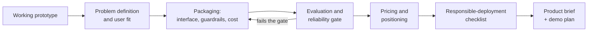
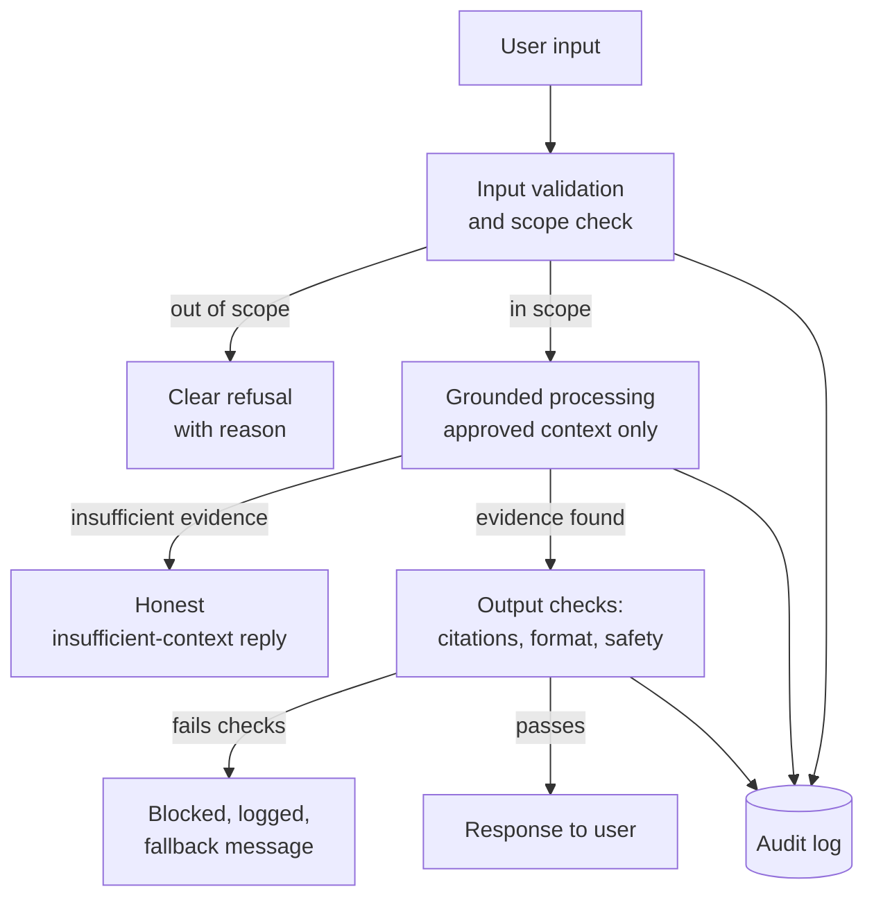
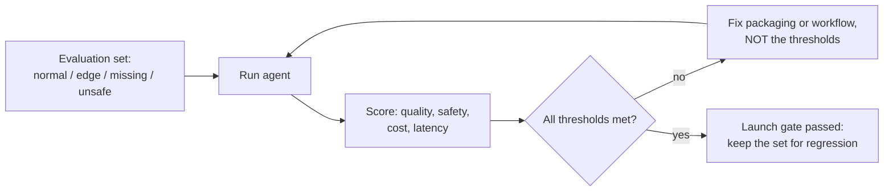
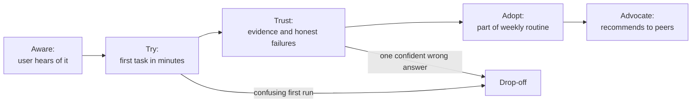

# FLIP: Agentic AI in Practice
**(Module 08: Advanced Agentic AI)**

---

## Session 8C: Productised AI Agents and Go-to-Market

---

**Table of Contents**

1. [Overview and Learning Goals](#m08c-overview)
2. [Problem Definition and User Fit](#m08c-problem)
3. [Packaging the Agent: Interface, Guardrails and Cost](#m08c-packaging)
4. [Evaluation and Reliability Before Launch](#m08c-evaluation)
5. [Pricing, Positioning and Responsible Deployment](#m08c-market)
6. [Student Tasks](#m08c-tasks)
7. [Submission and Reflection](#m08c-submission)

---

<a id="m08c-overview"></a>

### 1. Overview and Learning Goals

Across this unit you have built agent prototypes: workflows that validate input, use tools, ground answers in approved context and refuse unsafe requests. This session asks the question that follows every good prototype: *what would it take for a stranger to rely on this?* Turning a working agent into a product is not mainly a coding task. It is a packaging, evaluation and communication task, and it is where most agent projects quietly fail.

The distance between a demo and a product is easy to underestimate. A demo needs to work once, for you, on input you chose. A product must work repeatedly, for people who did not build it, on input you never imagined, at a cost someone is willing to pay, without causing harm you did not anticipate. Think of the difference between cooking a good meal for friends and opening a restaurant: the recipe is necessary, but the restaurant succeeds or fails on everything around the recipe — the menu, the prices, the food-safety inspection, the ability to serve the same dish reliably two hundred times.

The path this handout follows:



By the end of this session you should be able to state precisely who an agent serves and what job it does, specify its interface and guardrails, estimate what one interaction costs, define the evaluation evidence required before launch, choose a defensible pricing and positioning approach, and assemble all of it into a one-page product brief with a demo plan — the two artefacts you produce in the student tasks.

This is a Markdown handout rather than a notebook because the deliverables are documents and decisions, not code. Keep your prototype from earlier sessions (for example the M08A evaluation workflow, the M08D MCP server or the M08E hook engine, or any agent you built in M04–M07) at hand: every section asks you to apply its ideas to *your* agent.

<a id="m08c-problem"></a>

### 2. Problem Definition and User Fit

Products fail more often from solving the wrong problem than from solving the right problem badly. Before any packaging work, you must be able to complete three sentences without hand-waving:

```text
1. The user: [a specific person or role, e.g. "a first-year teaching
   assistant preparing lab feedback"]
2. The job: [the task they already do, e.g. "checking 120 student
   submissions against a marking checklist every week"]
3. The improvement: [what changes, measurably, e.g. "first-pass
   screening drops from 10 hours to 2, with every flag citing evidence"]
```

Notice what this format forces. The user is a person, not "everyone". The job already exists — the strongest agent products attach to work someone is currently doing painfully, rather than inventing new work. The improvement is measurable, which means you will later be able to test whether it is real.

A simple test of user fit is to ask where your agent sits on two axes: how costly is a wrong answer, and how easily can the user check the answer? Agents shine where errors are cheap to catch and checking is easy (drafting, screening, summarising with citations). They are dangerous where errors are expensive and hard to detect (unsupervised decisions about money, health, grades or access). If your prototype sits in the dangerous quadrant, the product answer is usually to move it: reposition the agent as a *recommender with evidence* whose output a human approves, exactly the human-review pattern you practised in M08B.

<div align="center">

<table>
<thead>
<tr><th><strong>Question</strong></th><th><strong>Weak answer (demo thinking)</strong></th><th><strong>Strong answer (product thinking)</strong></th></tr>
</thead>
<tbody>
<tr><td align="left">Who is it for?</td><td>"Anyone who needs research help."</td><td>"Unit coordinators preparing weekly reading summaries for one course."</td></tr>
<tr><td align="left">What job does it do?</td><td>"It can answer questions about documents."</td><td>"It produces a first-draft summary with page-level citations that the coordinator edits."</td></tr>
<tr><td align="left">Why an agent at all?</td><td>"AI is powerful."</td><td>"The job is repetitive, evidence-based and checkable; errors are visible and cheap."</td></tr>
<tr><td align="left">What does success look like?</td><td>"Users like it."</td><td>"Coordinator edits less than 20% of the draft; zero uncited claims per summary."</td></tr>
</tbody>
</table>

</div>

Expected outcomes when you apply this to your own prototype — normal: you can fill in all three sentences and place the agent in the safe quadrant. Edge: the user is real but the improvement is unmeasured; your demo plan (Section 6) must then include measuring it. Failure: you cannot name a specific user, which means you have a technology, not a product — go back and find the job before continuing.

<a id="m08c-packaging"></a>

### 3. Packaging the Agent: Interface, Guardrails and Cost

Packaging is everything that stands between your workflow code and a user who has never read it. Three components matter most: the interface, the guardrails, and the cost model.

#### 3.1 Interface

The interface decision is about matching the user's existing habits, not about ambition. A chat window is only one option, and often the wrong one: chat invites unbounded input, and unbounded input is where agents embarrass themselves. A form with three fields, a button inside an existing tool, a daily email digest, or an API endpoint consumed by another system all constrain input to what the agent handles well. The narrower the doorway, the fewer the surprises. For each candidate interface, ask: what inputs can arrive through this door that my agent was never tested on, and can I narrow the door instead of hardening the whole house?

Equally important is how the output presents uncertainty. Your prototypes already produce structured results with statuses like `completed`, `insufficient_context` and `refused`. A product must surface those honestly: an "I could not find enough evidence" state shown plainly to the user is a feature; the same state paraphrased into confident-sounding filler is a defect that evaluation must catch.

#### 3.2 Guardrails

Every guardrail you built in this unit reappears here as a product requirement:



Write the guardrails down as a table — what is blocked, what is refused with explanation, what is logged — because in a product, guardrails you cannot enumerate are guardrails you cannot test, and guardrails you cannot test do not exist. Include the operational ones that prototypes ignore: a per-user rate limit, a maximum input size, a timeout, and a kill switch that turns the agent off without turning off the product around it.

#### 3.3 Cost model

Agents have a property most software does not: every single use costs real money (model tokens, tool calls, hosting). You must know the unit economics before pricing anything. Estimate per interaction:

```text
cost per interaction ≈ (input tokens + output tokens) x token price
                       + tool/API call costs
                       + amortised hosting and monitoring

Then multiply by realistic usage:
monthly cost per user ≈ cost per interaction x interactions per month
```

Do this arithmetic with honest numbers from your own prototype runs (your notebooks print enough to estimate token counts). The result drives design: if one interaction costs 40 cents and your user runs 300 a month, a 10-dollar subscription loses money, and you must either use a cheaper model for the easy steps, cache repeated context, shorten prompts, or charge differently. Cost is a design input, not an accounting afterthought.

<a id="m08c-evaluation"></a>

### 4. Evaluation and Reliability Before Launch

You would not ship a bridge because it held up the engineer who built it. The evaluation gate answers one question with evidence: *does the agent behave acceptably on inputs you did not hand-pick, and does it fail safely on the rest?* Everything you practised in the M08 notebooks — normal, edge and failure cases; grounding checks; refusal behaviour; audit logs — becomes a launch requirement here.

Build a small evaluation set before launch, deliberately shaped like reality rather than like your demo:

<div align="center">

<table>
<thead>
<tr><th><strong>Case class</strong></th><th><strong>What it contains</strong></th><th><strong>What must happen</strong></th><th><strong>Suggested share</strong></th></tr>
</thead>
<tbody>
<tr><td align="left">Normal</td><td>Typical, well-formed requests from the target job.</td><td>Correct, grounded output; citations where claimed.</td><td>~50%</td></tr>
<tr><td align="left">Edge</td><td>Long inputs, odd formats, ambiguous phrasing, borderline scope.</td><td>Either correct handling or an honest limitation — never confident nonsense.</td><td>~25%</td></tr>
<tr><td align="left">Missing information</td><td>Requests the approved context cannot answer.</td><td>Explicit insufficient-context response; no invention.</td><td>~15%</td></tr>
<tr><td align="left">Unsafe / adversarial</td><td>Prompt-injection attempts, requests for private data, out-of-policy asks.</td><td>Refusal with reason; event logged; no side effects.</td><td>~10%</td></tr>
</tbody>
</table>

</div>

Track a small set of metrics across four dimensions, and set pass thresholds *before* you run the evaluation, so the numbers cannot negotiate with your hopes: **quality** (task success rate, uncited-claim rate), **safety** (refusal correctness on unsafe cases — misses and false alarms both count), **cost** (average cost per interaction against the Section 3.3 estimate), and **latency** (time to first useful output; users abandon slow agents long before they distrust wrong ones).



Two rules complete the gate. First, the evaluation set outlives the launch: re-run it after every meaningful change (a new model version, a new prompt, a new tool), exactly as the M08B baseline suite protected the repository. Second, decide in advance what post-launch monitoring exists — at minimum the audit logging you built in M08E, a user feedback channel, and a named person who reads both — because evaluation before launch bounds the risk, while monitoring after launch is how you learn the truth.

<a id="m08c-market"></a>

### 5. Pricing, Positioning and Responsible Deployment

#### 5.1 Pricing basics

Price is a claim about value, constrained by your unit cost. For agent products, three simple models cover most cases:

<div align="center">

<table>
<thead>
<tr><th><strong>Model</strong></th><th><strong>How it works</strong></th><th><strong>Fits when</strong></th><th><strong>Main risk</strong></th></tr>
</thead>
<tbody>
<tr><td align="left">Subscription</td><td>Flat fee per user per month.</td><td>Usage per user is predictable and bounded.</td><td>Heavy users make you lose money per seat.</td></tr>
<tr><td align="left">Usage-based</td><td>Pay per interaction, document or task.</td><td>Value and cost both scale with use.</td><td>Unpredictable bills discourage adoption.</td></tr>
<tr><td align="left">Value/outcome tier</td><td>Priced against the job replaced (e.g. per report delivered).</td><td>Output maps to something the buyer already budgets for.</td><td>You carry the reliability risk of the outcome.</td></tr>
</tbody>
</table>

</div>

Whatever the model, the floor is your Section 3.3 unit cost with a margin, and the ceiling is the user's alternative: the hours the job currently takes, or the price of the tool they would use instead. A defensible price sits between the two, and you should be able to state both numbers.

#### 5.2 Positioning

Positioning is one honest sentence: *for [user], [product] does [job] better than [alternative] because [reason]*. The alternative is rarely another AI product — it is usually "doing it by hand" or "not doing it at all". Two positioning rules matter specifically for agents. Do not promise autonomy you have not evaluated: "drafts with citations for your review" is a keepable promise, while "fully automates your reporting" invites the exact failures your evaluation set marked unsafe. And make the human-in-the-loop part of the pitch rather than an apology — in evidence-critical domains, "you approve everything it does" is a selling point.



The funnel above is where agent products differ most from ordinary software: trust is the narrow stage. A single confidently wrong answer early in a user's experience costs more adoption than ten honest "insufficient context" responses. Design the first-run experience around tasks from your evaluation set's normal class, where you *know* the agent performs.

#### 5.3 Responsible-deployment checklist

Before any launch — including a pilot with one friendly user — every row of this checklist needs an answer you could say out loud to the affected users:

<div align="center">

<table>
<thead>
<tr><th><strong>Item</strong></th><th><strong>Question to answer</strong></th></tr>
</thead>
<tbody>
<tr><td align="left">Disclosure</td><td>Do users know they are interacting with an AI system, and what it can and cannot do?</td></tr>
<tr><td align="left">Data handling</td><td>What user data is stored, where, for how long, and who can see it? Is any of it used for further training?</td></tr>
<tr><td align="left">Human oversight</td><td>Which outputs require human approval before they take effect, and is that enforced by the system rather than by habit?</td></tr>
<tr><td align="left">Failure communication</td><td>When the agent is wrong or unavailable, what does the user see, and whom can they contact?</td></tr>
<tr><td align="left">Recourse and correction</td><td>How does a user dispute or correct an agent output that affects them?</td></tr>
<tr><td align="left">Kill switch</td><td>Can you disable the agent quickly without destroying user data or the surrounding product?</td></tr>
<tr><td align="left">Monitoring ownership</td><td>Who reads the audit logs and feedback, and how often?</td></tr>
<tr><td align="left">Legal and policy fit</td><td>Does the deployment respect the licences of models, data and tools, and the policies of the deployment context (for example, education-sector rules)?</td></tr>
</tbody>
</table>

</div>

<a id="m08c-tasks"></a>

### 6. Student Tasks

The deliverables are a **one-page product brief** and a **demo plan** for an agent prototype you built earlier in this unit (or a comparable prototype approved by your instructor). Keep both documents concrete: numbers, named users, real thresholds.

<div align="center">

<table>
<thead>
<tr><th><strong>Task</strong></th><th><strong>What you need to do</strong></th><th><strong>Why it matters</strong></th><th><strong>Expected evidence</strong></th></tr>
</thead>
<tbody>
<tr><td align="left">Task 1: Define problem and user fit</td><td>Complete the three sentences from Section 2 for your prototype and place it on the error-cost/checkability axes. Edge: if it lands in the dangerous quadrant, reposition it as a human-approved recommender and say so explicitly.</td><td>Everything downstream depends on a specific user and a measurable improvement.</td><td>The three completed sentences plus a two-sentence quadrant justification.</td></tr>
<tr><td align="left">Task 2: Specify the packaging</td><td>Choose an interface and justify it against at least one rejected alternative; produce a guardrail table (blocked / refused-with-reason / logged, plus rate limit, input cap, timeout, kill switch); estimate cost per interaction and per user per month with the Section 3.3 arithmetic and honest token numbers.</td><td>Interface, guardrails and unit cost are the difference between a workflow and an offering.</td><td>Interface decision, guardrail table, cost arithmetic shown.</td></tr>
<tr><td align="left">Task 3: Design the launch evaluation</td><td>Draft an evaluation set of at least 12 cases across the four classes (normal, edge, missing-information, unsafe) with pass thresholds fixed in advance for quality, safety, cost and latency. Failure: thresholds written after seeing results do not count — date-stamp them.</td><td>The evaluation gate is what separates "worked in the demo" from "ready for a stranger".</td><td>The case list with expected behaviour per case and the threshold table.</td></tr>
<tr><td align="left">Task 4: Price and position</td><td>Pick a pricing model, state the cost floor and the alternative-based ceiling with numbers, and write the one-sentence positioning statement including the honest human-in-the-loop framing.</td><td>A price you cannot defend and a promise you cannot keep are the two classic agent go-to-market failures.</td><td>Pricing paragraph with both numbers; the positioning sentence.</td></tr>
<tr><td align="left">Task 5: Complete the responsible-deployment checklist</td><td>Answer every row of the Section 5.3 checklist for your product in one or two sentences each. Edge: "not applicable" is acceptable only with a reason.</td><td>Responsibility items retrofitted after launch cost more and protect less.</td><td>The completed checklist.</td></tr>
<tr><td align="left">Task 6: Assemble the brief and demo plan</td><td>Condense Tasks 1–5 into a one-page product brief (user, job, improvement, interface, guardrails, unit cost, price, positioning, launch gate). Then write a demo plan: three scripted scenarios — one normal success, one honest insufficient-context or edge case, one refused unsafe request — each with the exact input and the expected visible behaviour.</td><td>The brief is what you would show a stakeholder; the demo that includes honest failure behaviour is what earns their trust.</td><td>One-page brief plus the three-scenario demo plan.</td></tr>
</tbody>
</table>

</div>

<a id="m08c-submission"></a>

### 7. Submission and Reflection

Submit a single document (Markdown or PDF) containing:

```text
1. Problem and user-fit statement (Task 1).
2. Packaging specification: interface, guardrail table, cost model (Task 2).
3. Launch evaluation set and thresholds (Task 3).
4. Pricing and positioning (Task 4).
5. Completed responsible-deployment checklist (Task 5).
6. The one-page product brief and the three-scenario demo plan (Task 6).
7. A 200-300 word reflection.
```

**Quality checks.** Before submitting, verify that the brief truly fits one page; that every number in it (cost, price, thresholds) traces to arithmetic or evidence elsewhere in the submission; that the demo plan includes the honest-failure scenario rather than three successes; that the positioning sentence promises only behaviour your evaluation set actually tests; and that no real API keys, private URLs or personal data appear anywhere.

**Debugging guide.** If your cost estimate collapses the business case, that is a finding, not a dead end — document the mitigation (cheaper model tier, caching, narrower interface) and recompute. If you cannot produce 12 evaluation cases, your problem definition is too vague; return to Task 1 and narrow the job. If the responsible-deployment checklist raises an item you cannot answer (typically data handling), constrain the product until you can — for example, "no user data stored beyond the session". If your demo's failure scenario looks embarrassing, redesign the *presentation* of failure (clear message, next step for the user), not the scenario selection.

**Reflection questions.**

1. Which single section of the brief changed your view of your own prototype the most, and why?
2. What is the strongest argument *against* launching your product as currently specified?
3. How does showing an honest failure in a demo change the trust relationship with a stakeholder, compared with showing only successes?
4. Which guardrail from your table would be hardest to enforce technically, and what would you do until it is enforced?
5. If usage grew tenfold overnight, which part of your packaging — interface, guardrails or cost model — would break first?

#### Further Readings

- Hugging Face model cards (documentation as product packaging): <https://huggingface.co/docs/hub/model-cards>
- NIST AI Risk Management Framework: <https://www.nist.gov/itl/ai-risk-management-framework>
- Australian AI Ethics Principles: <https://www.industry.gov.au/publications/australias-artificial-intelligence-ethics-principles>
- OpenAI usage policies (an example of published deployment boundaries): <https://openai.com/policies/usage-policies/>
- Anthropic usage policy (comparative example): <https://www.anthropic.com/legal/aup>
